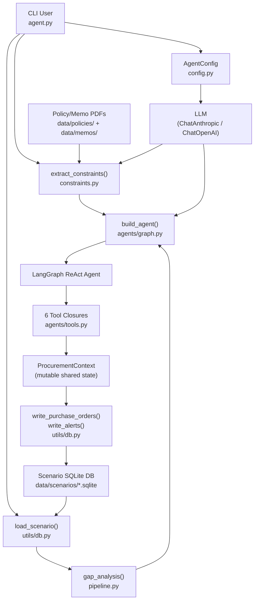
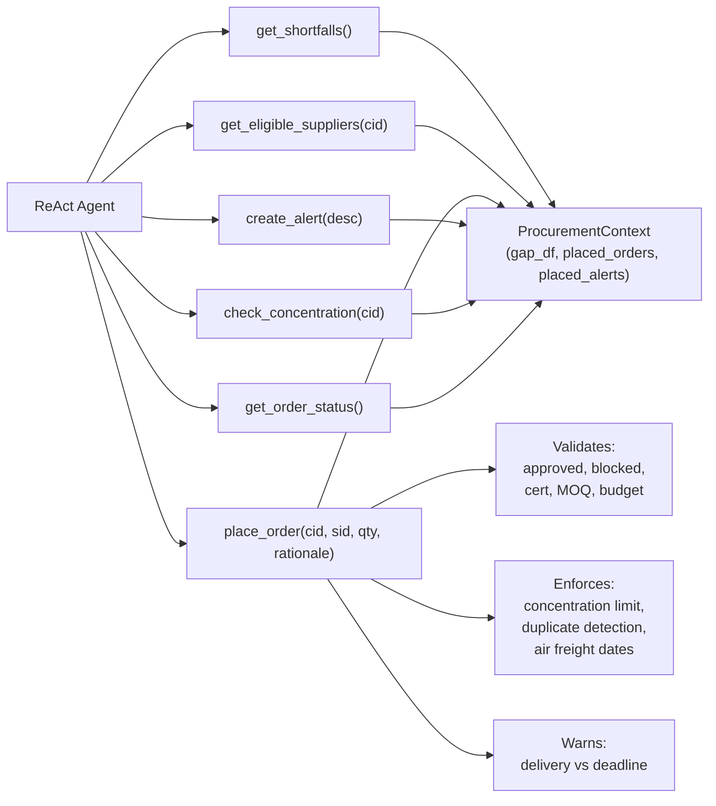
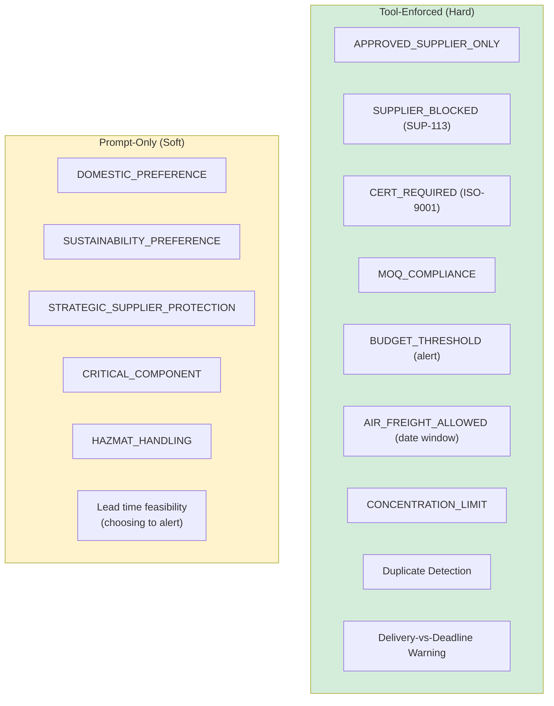
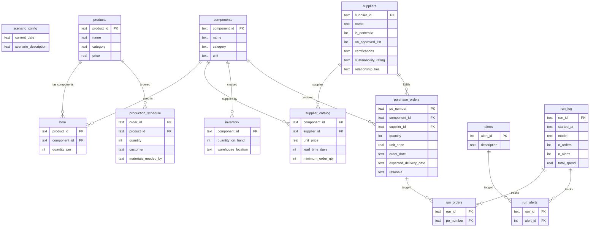

# ProcureAI — Current State (2026-04-23)

## 1. System Overview

**Project:** ProcureAI — Autonomous AI procurement agent for Apex Manufacturing
**Phase:** Post-MVP with active improvement work (Step 1: enriched tools partially implemented; Step 2: planner/executor planned)
**Repo type:** Single-package Python application

### Technology Stack
- **Language:** Python 3.12 (managed with `uv`)
- **LLM Framework:** LangGraph + LangChain (ReAct agent pattern)
- **LLM Providers:** Anthropic (primary), OpenAI, vLLM, Ollama via `ChatAnthropic`/`ChatOpenAI`
- **Data:** SQLite scenario databases + PDF policy documents
- **Pipeline:** pandas (deterministic BOM explosion + gap analysis)
- **Config:** Pydantic Settings (env vars / `.env`)
- **CLI:** Click
- **Viz:** Plotly (HTML dashboards), Rich (verbose agent output)
- **Testing:** pytest + pytest-cov
- **Linting:** ruff

---

## 2. Architecture Diagrams

### a) High-Level Architecture



### b) Agent Pipeline (Execution Flow)

```mermaid
flowchart LR
    A["1. Load Scenario<br/>(SQLite → ScenarioData)"] --> B["2. Config + LLM<br/>(Pydantic Settings)"]
    B --> C["3. Start Run Log<br/>(transaction tracking)"]
    C --> D["4. Extract Constraints<br/>(PDF → LLM → Constraint[])"]
    D --> E["5. Gap Analysis<br/>(BOM explosion → shortfalls)"]
    E --> F["6. Build Agent<br/>(LangGraph ReAct)"]
    F --> G["7. Agent Loop<br/>(tool calls until gaps=0)"]
    G --> H["8. Write Results<br/>(POs + alerts → SQLite)"]
    H --> I["9. Finalize Run Log"]
```



### c) Tool Dependency Diagram



### d) Constraint Enforcement Spectrum



---

## 3. Entity Relationship Diagram (ERD)

### Scenario Database Schema



---

## 4. Frontend Architecture

**Not implemented.** This is a CLI-only application. The Plotly dashboard (`procureai/discovery/dashboard.py`) generates static HTML files for data exploration but is not part of the agent runtime.

---

## 5. Key Abstractions and Interfaces

### `ScenarioData` (dataclass — `procureai/utils/db.py:29`)
Immutable bundle of all tables from a scenario SQLite database. Fields: `current_date`, `description`, `db_path`, and one `pd.DataFrame` per table.

### `AgentConfig` (Pydantic BaseSettings — `procureai/config.py:28`)
Configuration loaded from env vars (`PROCUREAI_*`) and `.env`. Supports 4 providers: `anthropic`, `openai`, `vllm`, `ollama`. Factory method `get_chat_model()` returns a LangChain `BaseChatModel`.

### `Constraint` (Pydantic BaseModel — `procureai/constraints.py:34`)
Typed constraint with `ConstraintType` enum (14 types), params dict, source, date range, and description. Extracted from PDFs by LLM or falls back to `DEFAULT_CONSTRAINTS`.

### `ProcurementContext` (dataclass — `procureai/agents/tools.py:21`)
Mutable shared state for all tools. Holds: `scenario`, `constraints`, `gap_df` (updated in-place), `placed_orders`, `placed_alerts`, PO sequence counter.

### `ProcurementState` (LangGraph MessagesState — `procureai/agents/state.py:8`)
Extends `MessagesState` with 5 additional fields (`shortfalls_summary`, `constraints_summary`, `scenario_summary`, `orders_placed`, `remaining_gaps`). **Note:** These additional fields are defined but never populated — they are dead code.

### Tool Functions (6 tools — `procureai/agents/tools.py`)
| Tool | Purpose | Key Enforcement |
|------|---------|-----------------|
| `get_shortfalls` | Return current gap table | Read-only |
| `get_eligible_suppliers` | Annotated supplier list per component | Filters: approved, blocked, cert, PCB. Annotates: delivery status, concentration, air freight |
| `place_order` | Place a PO and update gaps | Enforces: MOQ, approved, blocked, cert, concentration, duplicate, budget alert, delivery warning |
| `create_alert` | Log a risk/escalation alert | Append-only |
| `check_concentration` | Show supplier share for a component | Read-only |
| `get_order_status` | Summary of orders + remaining gaps | Read-only |

---

## 6. File Structure

```
Take-Home Assignment/
├── agent.py                           # CLI entry point (Click)
├── main.py                            # Unused stub
├── pyproject.toml                     # Dependencies and build config (hatchling)
├── uv.lock                            # Locked dependencies
├── .env                               # API keys + model config (gitignored)
├── CLAUDE.md                          # AI agent instructions
├── AGENTS.md                          # Cross-platform agent config
├── TODO.md                            # Open items tracker
├── summary.md                         # Scenario data analysis
├── procureai/
│   ├── __init__.py
│   ├── config.py                      # AgentConfig + get_chat_model()
│   ├── pipeline.py                    # Deterministic BOM → gap analysis
│   ├── constraints.py                 # Constraint schema + PDF extraction
│   ├── agents/
│   │   ├── __init__.py
│   │   ├── graph.py                   # build_agent() → LangGraph ReAct
│   │   ├── tools.py                   # 6 tools + ProcurementContext
│   │   ├── prompts.py                 # build_system_prompt()
│   │   ├── state.py                   # ProcurementState (partially dead)
│   │   └── callbacks.py              # RichCallbackHandler (--verbose)
│   ├── discovery/
│   │   ├── __init__.py
│   │   ├── overview.py                # Terminal scenario viewer
│   │   └── dashboard.py              # Plotly HTML dashboard generator
│   └── utils/
│       ├── __init__.py
│       └── db.py                      # SQLite load/write + transaction log
├── data/                              # (gitignored)
│   ├── scenarios/                     # 6 SQLite databases
│   ├── policies/                      # procurement_policy.pdf
│   └── memos/                         # 3 memo PDFs (concentration, shipping, PCB)
├── tests/
│   ├── __init__.py
│   ├── conftest.py                    # Shared fixtures (parameterized across scenarios)
│   ├── test_verification.py           # 16 post-run verification tests
│   └── test_tools.py                 # 18 unit tests for tool-level enforcement
├── plans/
│   ├── stage-1-build-agent-loop.md
│   ├── fix-plan.md
│   ├── step1-enriched-tools-implementation-plan.md
│   ├── verification-plan.md
│   ├── test-procedure.md
│   └── discovery-scripts.md
├── research/
│   ├── current-state-2026-04-23.md    # This document
│   ├── planner-executor-sketch.md     # Step 2 design
│   └── procurement-gaps-design-2026-04-23.md
├── scripts/
│   └── set-model.sh                   # Switch provider/model in .env
└── output/                            # Generated dashboards, eval reports
```

---

## 7. Current Implementation Status

### Completed
- Full agent pipeline: scenario load → constraint extraction → gap analysis → ReAct loop → PO/alert write-back
- Multi-provider support (Anthropic, OpenAI, vLLM, Ollama) with `AgentConfig`
- Transaction log (`run_log`, `run_orders`, `run_alerts`) with `--clean` / `--clean-run-id` / `--list-runs`
- 6 agent tools with closure-based state sharing
- PDF constraint extraction with `DEFAULT_CONSTRAINTS` fallback
- Tool-enforced constraints: approved supplier, blocked supplier, cert check, MOQ, budget alerts, air freight date window, concentration limits, duplicate detection, delivery-vs-deadline warnings
- Enriched `get_eligible_suppliers` output with delivery status, concentration impact, max quantities, air freight annotations, constraint notes
- Rich callback handler for verbose agent observation
- Discovery tools: terminal overview, Plotly HTML dashboards
- Post-run verification test suite (16 tests, parameterized across scenarios)
- Unit test suite for tool enforcement (18 tests)
- Multi-model evaluation (Sonnet 4.6, Haiku 4.5, Qwen 2.5 7B) — results in `output/`
- Model switching script (`scripts/set-model.sh`)

### In Progress
- **Step 1 plan** exists (`plans/step1-enriched-tools-implementation-plan.md`) — enriched tools are implemented; additional constraint hardening items remain
- **Design doc** for procurement gaps (`research/procurement-gaps-design-2026-04-23.md`) — recently created

### Planned (Not Yet Implemented)
- **Step 2: Planner/Executor decomposition** — split strategy from execution; design sketch at `research/planner-executor-sketch.md`
- Pre-extracted PDF → markdown for deterministic constraint data (eliminating LLM dependency for constraints)
- Generic `is_constraint_active(constraint, current_date)` temporal filter
- Delivery-vs-deadline feasibility check in `place_order` (auto-alert when late)
- Wiring of `ProcurementState` extra fields (currently dead code)
- Removal of unused `main.py` stub

---

## 8. Dependencies

### Runtime
| Package | Purpose |
|---------|---------|
| `anthropic` >=0.52.0 | Anthropic API client |
| `langchain-anthropic` >=0.3.12 | LangChain ChatAnthropic wrapper |
| `langchain-openai` >=0.3.0 | LangChain ChatOpenAI wrapper |
| `langchain-core` >=0.3.49 | Base LangChain abstractions |
| `langchain` >=1.2.15 | Agent creation (`create_agent`) |
| `langgraph` >=0.4.1 | Graph-based agent orchestration |
| `pandas` >=3.0.2 | Tabular data processing |
| `plotly` >=6.7.0 | Dashboard HTML generation |
| `pydantic-settings` >=2.9.1 | Typed configuration from env |
| `pypdf` >=5.4.0 | PDF text extraction |
| `click` >=8.3.3 | CLI framework |
| `rich` >=13.0.0 | Terminal formatting |

### Dev
| Package | Purpose |
|---------|---------|
| `pytest` >=8.0.0 | Test runner |
| `pytest-cov` >=6.0.0 | Coverage reporting |
| `ruff` >=0.11.0 | Linting + formatting |
| `hatchling` >=1.29.0 | Build backend |
| `ipykernel` / `nbformat` | Notebook support |

---

## 9. Testing Coverage

### Test Files

| File | Tests | What It Covers |
|------|-------|----------------|
| `tests/test_verification.py` | 16 | Post-run verification: blocked suppliers, PCB certs, magnet concentration (max + min secondary), MOQ, price accuracy, delivery dates, rationale, hallucinated IDs, shortfall coverage, approved-only, duplicate detection. Plus scenario-specific: S06 (happy path), S02 (partial procurement), S03 (tight timeline), S05 (no air freight after expiry). |
| `tests/test_tools.py` | 18 | Unit tests for tool enforcement: delivery-vs-deadline warnings (3 tests), concentration limit enforcement (5 tests), duplicate order detection (4 tests), enriched get_eligible_suppliers output (5 tests including air freight annotation). |

### Coverage Gaps
- **No unit tests for:** `pipeline.py` (BOM explosion, gap analysis), `constraints.py` (PDF extraction, constraint parsing), `config.py` (provider validation), `utils/db.py` (load/write/clean operations)
- **Verification tests are post-hoc** — they run against scenario DBs that already have agent-placed POs, not against agent behavior in isolation
- **No integration tests** — no test that runs the full pipeline end-to-end with a mock LLM
- **Target coverage (per AGENTS.md): 80%+** — likely not met given untested modules

### Model Eval Results (2026-04-23)

| Metric | Sonnet 4.6 | Haiku 4.5 | Qwen 2.5 7B |
|--------|-----------|-----------|-------------|
| Pass / Fail / Skip | 73 / 4 / 10 | 73 / 8 / 6 | 64 / 12 / 11 |
| All gaps covered | 6/6 | 6/6 | **1/6** |
| Magnet concentration | 4/6 | **2/6** | **3/6** |
| Duplicates | **5/6** | 6/6 | 6/6 |

**Key insight:** Tool-enforced constraints pass across all models. Prompt-only constraints degrade with model capability.

---

## 10. Known Hard-Coded Values and Assumptions

### In Tool Code (`tools.py`)
- PO numbering: `PO-AGENT-{seq:03d}` — agent orders are identified by this prefix throughout the codebase (tests, cleanup, verification)
- Date format: strictly `%Y-%m-%d` everywhere, no timezone handling
- Air freight defaults: `lead_time_reduction=14`, `min_lead_time=7` when not specified in constraint params
- Concentration limit default: `max_pct=0.5` when not specified in constraint params

### In Constraint Defaults (`constraints.py`)
- `DEFAULT_CONSTRAINTS` hard-codes 7 constraints (fallback when LLM extraction fails):
  - `SUP-113` blocked, `CMP-005` requires ISO-9001, `CMP-010`/`CMP-011` hazmat
  - Budget threshold $50K, domestic preference 35%/50%
- **Missing from defaults:** `AIR_FREIGHT_ALLOWED`, `PCB_QUALIFIED_ONLY`, `SUSTAINABILITY_PREFERENCE`, `STRATEGIC_SUPPLIER_PROTECTION`, `CONCENTRATION_LIMIT`
- If LLM fails to extract constraints, these rules silently disappear

### In Verification Tests (`test_verification.py`)
- `BLOCKED_SUPPLIER = "SUP-113"` — hard-coded
- `PCB_COMPONENT = "CMP-005"` — hard-coded
- `MAGNET_COMPONENT = "CMP-003"` — hard-coded
- Magnet concentration assertions use 55% and 18% (5%/2% tolerance on 50%/20% policy)
- Scenario-specific test classes reference exact DB filenames and expected dates

### In Pipeline (`pipeline.py`)
- Assumes `production_schedule` has `materials_needed_by` column
- Assumes `bom` join key is `product_id`
- No safety stock concept — gap = needed - on_hand - incoming, anything <= 0 is ignored

### In Config (`config.py`)
- Default model: `claude-sonnet-4-6`
- Default temperature: `0.0`
- Default max tokens: `4096`
- Policy/memo directories resolved relative to `__file__` location

### Architectural Assumptions
- **Single-date snapshot:** system is purely reactive — one `current_date`, fill all gaps, done. No rolling horizon or multi-period planning
- **Flat constraint model:** constraints listed independently in prompt; no mechanism for composing interacting constraints (e.g., critical + hazmat + cert + concentration on same component)
- **No delivery feasibility gate:** `place_order` warns about late delivery but does not prevent it — the LLM decides whether to alert vs order
- **Agent has no memory across runs:** each invocation is independent; prior run POs are in DB but not reasoned about as a plan
