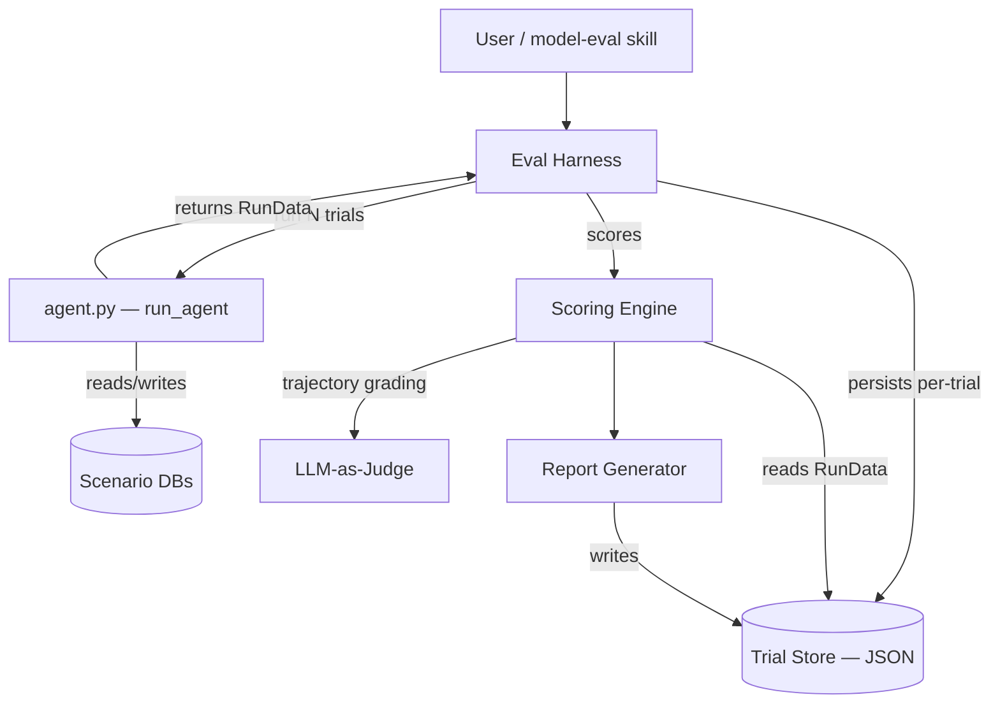
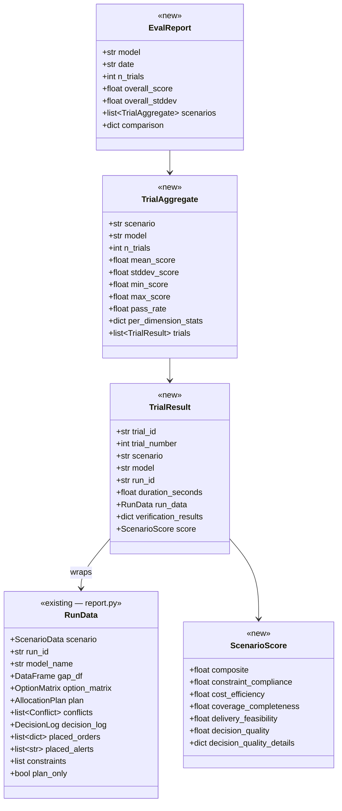
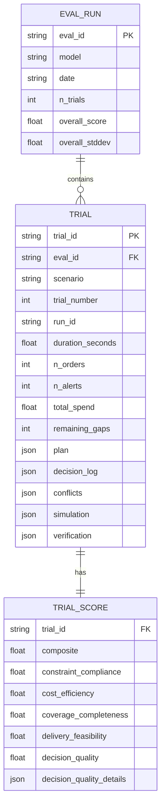
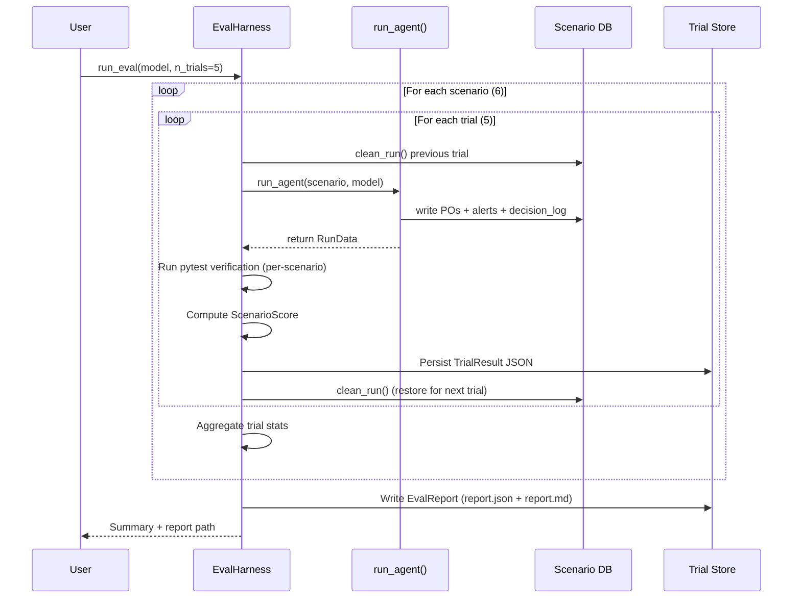
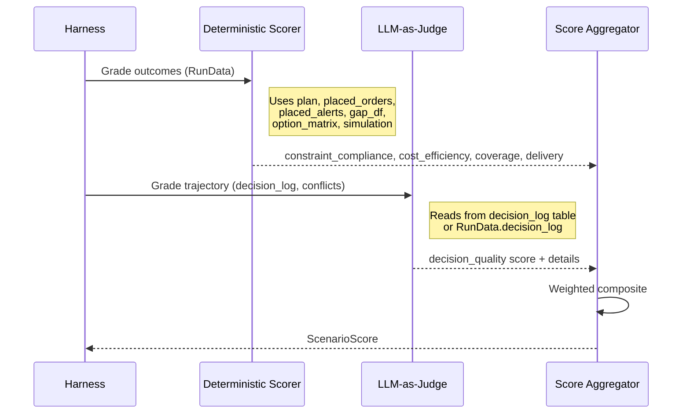
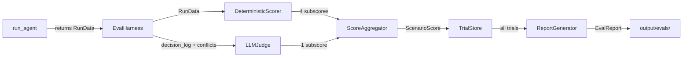

# Eval System Upgrade: Multi-Trial Scoring & Trajectory Evaluation

**Date**: 2026-04-23
**Author**: Claude Code
**Status**: Draft

## Problem Statement

ProcureAI's current evaluation system runs each scenario once and reports binary pass/fail per test. This has three problems:

1. **No variance signal** — The LLM reviewer is stochastic. A single run can't distinguish "always passes" from "coin flip." With the current system, a model that passes magnet concentration 3/5 times looks identical to one that passes 5/5.

2. **No scoring granularity** — A model that gets 45% magnet concentration (barely fails) scores the same as one at 100% (catastrophic). There's no way to measure improvement short of flipping a binary.

3. **Decision quality is ungraded** — The `DecisionLog` is now persisted to a `decision_log` table in SQLite (with source, rationale, conflict linkage per entry), and the `RunData` dataclass bundles the full plan, conflicts, and decision log for HTML report generation. But none of this rich trajectory data is *scored* — we can inspect it in the HTML report, but we can't compare decision quality across models or runs numerically.

## Existing Infrastructure (what we build on)

The codebase already has the pieces we need:

| Component | Location | What it provides |
|-----------|----------|-----------------|
| `RunData` | `procureai/report.py:31` | Dataclass bundling scenario, plan, conflicts, decision_log, placed_orders, placed_alerts, constraints — everything for one run |
| `decision_log` table | `procureai/utils/db.py:97` | Persists every decision (component, action, source, rationale, conflict_id) per run_id |
| `write_decision_log()` | `procureai/utils/db.py:197` | Writes `DecisionLog.to_dicts()` to SQLite |
| `simulate_plan()` | `procureai/planner.py:765` | Validates a plan against all constraints, returns `{verdict, violations, warnings}` |
| `run_log` table | `procureai/utils/db.py:73` | Tracks run_id, model, n_orders, n_alerts, total_spend |
| `clean_run()` | `procureai/utils/db.py` | Deletes a run's orders, alerts, and decision_log entries — enables clean trial cycling |
| HTML report | `procureai/report.py` | Per-run report with options matrix, plan, conflicts, decision log |

**Key implication**: The eval harness doesn't need a new `AgentRunResult` type — `RunData` already is that type. The harness just needs to call the agent programmatically and capture the `RunData` that's already constructed at [agent.py:312](agent.py#L312).

## Goals and Non-Goals

**Goals**:
- Run 5 trials per scenario per model, persisting per-trial results
- Produce a weighted composite score (0-100) per scenario and overall
- Grade decision quality via LLM-as-judge on the persisted `decision_log`
- Aggregate statistics (mean, stddev, min, max) across trials
- Remain compatible with the existing `model-eval` skill workflow

**Non-Goals**:
- CI/CD integration
- Real-time monitoring or dashboards
- Changing the agent architecture or tools
- Replacing the existing pytest verification suite (it stays as-is; scoring layers on top)

## System Context



## Interface Contracts



## Data Model

The eval system has two storage layers:

1. **Scenario SQLite** (existing) — `run_log`, `run_orders`, `run_alerts`, `decision_log` tables. Written by the agent during each trial, cleaned between trials.

2. **Trial Store** (new) — JSON files under `output/evals/`. Captures the full `RunData` snapshot + score per trial. This is the durable record since the scenario DB is cleaned between trials.



**Storage format**: JSON files under `output/evals/{model}/{date}/{eval_id}/`. One file per trial plus an aggregate report. JSON over SQLite because:
- Easier to diff across runs and commit to git
- Plan/decision log/conflict structures are deeply nested
- No cross-eval queries needed (each eval is self-contained)
- Human-readable for debugging

## Key Workflows

### Multi-Trial Execution



### Agent Interface Change

The key prerequisite: extract a `run_agent()` function from `agent.py` that returns `RunData` instead of only printing. The CLI `main()` calls `run_agent()` and then prints/opens the HTML report. The eval harness calls `run_agent()` directly and captures the result.

```python
# In agent.py (or a new procureai/runner.py)
def run_agent(scenario_path: str, model: str | None = None) -> RunData:
    """Run the full agent pipeline and return structured results.

    Handles: load_scenario, extract_constraints, gap_analysis,
    greedy_allocate, LLM review, execute, write to DB.
    Returns the RunData with all plan/decision/order data.
    """
    ...
```

This is a small refactor — `_run_planner_executor()` already constructs `RunData` at [agent.py:312](agent.py#L312). We just need it to return it instead of only passing it to `generate_report()`.

### Scoring Pipeline



## Scoring Rubric

### Composite Score (0-100)

| Dimension | Weight | What it measures | Scoring method |
|-----------|--------|-----------------|----------------|
| Constraint Compliance | 30% | Hard constraint adherence | Deterministic |
| Coverage Completeness | 25% | All gaps addressed | Deterministic |
| Cost Efficiency | 15% | Spend vs optimal | Deterministic |
| Delivery Feasibility | 15% | On-time delivery rate | Deterministic |
| Decision Quality | 15% | Reasoning quality | LLM-as-Judge |

### Dimension Details

#### Constraint Compliance (30%, deterministic)

Each constraint check contributes proportionally. Partial credit for near-misses.

| Check | Full credit (1.0) | Partial credit | Zero (0.0) |
|-------|----------|----------------|------------|
| Blocked supplier | No orders to SUP-113 | — | Any order to SUP-113 |
| Approved only | All suppliers approved | — | Any unapproved |
| PCB certification | All PCB from ISO-9001 | — | Any non-certified |
| Magnet max 50% | All suppliers <=50% | Linear: 1.0 at 50%, 0.0 at 100% | Single-source 100% |
| Magnet min 20% secondary | Secondary >=20% | Linear: 1.0 at 20%, 0.0 at 0% | Single-source |
| MOQ compliance | All orders >= MOQ | Ratio of compliant orders | All below MOQ |
| Price accuracy | All prices match catalog | Ratio of accurate prices | — |
| No duplicates | Zero duplicates | — | Any duplicates |
| No hallucinated IDs | All IDs valid | Ratio of valid IDs | — |

Formula: `constraint_compliance = mean(all applicable check scores)`

Checks that don't apply to a scenario (e.g., no magnet orders in s06) are excluded from the mean, not scored as 1.0. This matches the existing pytest `skip` behavior.

#### Coverage Completeness (25%, deterministic)

Measures what fraction of shortfalls were resolved by POs or acknowledged by alerts.

```
addressed = components with PO + components with alert
total = components in gap_df

coverage = addressed / total

# Bonus for full resolution (PO quantity >= gap)
fully_resolved = components where sum(PO qty) >= gap
resolution_depth = fully_resolved / total

coverage_completeness = 0.7 * coverage + 0.3 * resolution_depth
```

#### Cost Efficiency (15%, deterministic)

Compares actual spend against a theoretical optimum. The optimal baseline is computed from the `OptionMatrix` (already built per trial), using the cheapest eligible supplier per component at exact gap quantity.

```
optimal_spend = sum(cheapest_eligible_price * gap_qty for each component)
actual_spend = sum(unit_price * quantity for each PO)

# Graceful degradation: 10% overspend = 0.90 score
efficiency = max(0, 1.0 - (actual_spend - optimal_spend) / optimal_spend)

# Don't penalize forced MOQ roundups
moq_overbuy_cost = sum of spend attributable to MOQ roundup
adjusted_efficiency = max(0, 1.0 - (actual_spend - optimal_spend - moq_overbuy_cost) / optimal_spend)

cost_efficiency = adjusted_efficiency
```

Note: concentration limits force dual-sourcing which increases cost. This is expected and the scorer should not penalize it — the optimal baseline also respects concentration limits (cheapest *feasible* allocation, not cheapest ignoring constraints).

#### Delivery Feasibility (15%, deterministic)

Measures on-time delivery rate and how the agent handles infeasible deadlines.

```
on_time = orders where expected_delivery <= deadline
total_orders = all POs placed

on_time_rate = on_time / total_orders

# Credit for flagging infeasible deadlines (alerts exist)
infeasible_components = components where all suppliers are late
flagged = infeasible_components that have alerts
flag_rate = flagged / infeasible_components (or 1.0 if none infeasible)

delivery_feasibility = 0.7 * on_time_rate + 0.3 * flag_rate
```

#### Decision Quality (15%, LLM-as-Judge)

An LLM evaluates the decision log trajectory. The decision log is read from `RunData.decision_log` (or equivalently from the `decision_log` SQLite table for that run_id). Graded on 5 sub-criteria, each 0-5:

| Sub-criterion | What the judge evaluates |
|--------------|------------------------|
| Rationale clarity | Are allocation rationales specific and justified, not generic? |
| Conflict handling | Were conflicts resolved thoughtfully? Did the reviewer add value vs just accepting defaults? |
| Tradeoff awareness | Does the decision log show awareness of competing objectives (cost vs delivery vs sustainability)? |
| Alert quality | Are alerts actionable with specific details (supplier, lead time, gap, what's infeasible)? |
| Consistency | Are similar components handled consistently across the plan? |

**Judge input**: The judge receives the serialized decision log (`DecisionLog.to_dicts()`), conflict list, final plan, and scenario summary. This is the same data visible in the HTML report's "Decision Log" and "Conflicts & Resolutions" sections.

**Judge prompt structure**:
```
You are evaluating the decision quality of a procurement agent.

Given:
- The decision log (all decisions with source and rationale)
- The conflict list (tradeoffs the agent faced)
- The final plan (allocations + alerts)
- The scenario context (gaps, suppliers, constraints)

Grade each dimension 0-5 (0=absent, 1=poor, 3=adequate, 5=excellent).
Return structured JSON with scores and one-sentence justifications.
```

The judge uses a cheap/fast model (Haiku) at temperature 0 for deterministic grading. Total cost per trial: ~$0.01.

```
decision_quality = sum(sub_scores) / 25.0  # normalized to 0-1
```

### Final Composite

```
composite = (
    0.30 * constraint_compliance +
    0.25 * coverage_completeness +
    0.15 * cost_efficiency +
    0.15 * delivery_feasibility +
    0.15 * decision_quality
) * 100
```

## Component Interaction



## Architecture Options

### Option 1: Eval harness as Python module (`procureai/eval/`)

Add a new `procureai/eval/` package with `harness.py`, `scorer.py`, `judge.py`, `report.py`. The `model-eval` skill invokes it, and it can also be run standalone via CLI.

**Pros**:
- First-class Python code, testable with pytest
- Imports `RunData`, `DecisionLog`, `AllocationPlan`, `OptionMatrix` directly
- Natural home for the scoring rubric
- CLI entrypoint: `python -m procureai.eval --model claude-haiku-4-5 --trials 5`

**Cons**:
- Requires a small refactor: extract `run_agent()` from `agent.py` so the harness can call it programmatically and get back `RunData`

**When to use**: When you want the eval system to be a permanent, maintained part of the codebase.

### Option 2: Standalone eval script (`scripts/eval.py`)

A single script that shells out to `agent.py`, then reads results from the DB and computes scores.

**Pros**:
- No changes to agent.py needed
- Simple, self-contained

**Cons**:
- Can read `decision_log` table from SQLite, but loses `OptionMatrix` (not persisted) — needed for cost efficiency baseline
- Can read `plan` from placed_orders, but loses `Conflict` list and `simulate_plan()` results
- Shell-based orchestration is fragile for 30 runs (5 trials x 6 scenarios)
- Hard to test

**When to use**: Quick prototype. Could work for deterministic scoring only (no cost efficiency, no LLM judge), but can't reach the full design.

### Recommendation

**Option 1** — `procureai/eval/` package. The `RunData` dataclass already bundles everything we need. The only prerequisite is extracting `run_agent()` to return it. The `OptionMatrix` (needed for cost efficiency baselines) and `Conflict` list (needed for the LLM judge) are only available in-memory — they're not persisted to SQLite — so the harness must call the agent as a Python function, not shell out.

## Agent Interface Change

Small refactor to `agent.py`:

1. Extract a `run_agent(scenario_path, model=None, verbose=False) -> RunData` function that runs the full pipeline and returns the `RunData` already constructed at [agent.py:312](agent.py#L312).

2. The CLI `main()` calls `run_agent()`, then prints the summary and opens the HTML report. No behavior change for CLI users.

3. The eval harness calls `run_agent()` directly, captures `RunData`, runs scoring, and persists results.

No new dataclass needed — `RunData` from `procureai/report.py` already has everything:

```python
@dataclass
class RunData:  # existing
    scenario: ScenarioData
    run_id: str
    model_name: str
    gap_df: pd.DataFrame
    option_matrix: OptionMatrix      # needed for cost efficiency baseline
    plan: AllocationPlan             # needed for scoring
    conflicts: list[Conflict]        # needed for LLM judge
    decision_log: DecisionLog        # needed for LLM judge
    placed_orders: list[dict]        # needed for deterministic scoring
    placed_alerts: list[str]         # needed for deterministic scoring
    constraints: list                # needed for scorer context
    plan_only: bool = False
```

## Trial Store Layout

```
output/evals/
  claude-haiku-4-5/
    2026-04-23/
      eval_a1b2c3/
        trial_01_scenario_06.json
        trial_02_scenario_06.json
        ...
        trial_05_scenario_06.json
        trial_01_scenario_01.json
        ...
        trial_05_scenario_03.json
        report.json           # EvalReport with aggregates
        report.md             # Human-readable summary
```

Each `trial_XX_scenario_YY.json`:
```json
{
  "trial_id": "t_abc123",
  "trial_number": 1,
  "scenario": "scenario_06_simple",
  "model": "claude-haiku-4-5",
  "run_id": "run_def456",
  "started_at": "2026-04-23T10:00:00Z",
  "finished_at": "2026-04-23T10:00:45Z",
  "duration_seconds": 45.2,
  "n_orders": 2,
  "n_alerts": 0,
  "total_spend": 820.00,
  "remaining_gaps": 0,
  "plan": { "allocations": [...], "alerts": [...] },
  "decision_log": [ { "component_id": "...", "action": "...", "source": "...", "rationale": "...", ... } ],
  "conflicts": [ { "type": "...", "component_id": "...", "description": "...", ... } ],
  "simulation": { "verdict": "PASS", "violations": [], "warnings": [] },
  "verification": {
    "test_no_blocked_suppliers": "PASS",
    "test_moq_compliance": "PASS"
  },
  "score": {
    "composite": 92.5,
    "constraint_compliance": 1.0,
    "coverage_completeness": 0.95,
    "cost_efficiency": 0.88,
    "delivery_feasibility": 0.90,
    "decision_quality": 0.85,
    "decision_quality_details": {
      "rationale_clarity": 4,
      "conflict_handling": 5,
      "tradeoff_awareness": 4,
      "alert_quality": 4,
      "consistency": 4,
      "justifications": {
        "rationale_clarity": "Rationales reference specific fitness scores and supplier names",
        "conflict_handling": "Reviewer resolved all 5 conflicts with substantive reasoning"
      }
    }
  }
}
```

## Report Format

The `report.md` mirrors the current eval report format but adds statistical depth:

```
# Model Evaluation: claude-haiku-4-5
**Trials per scenario**: 5
**Overall score**: 91.3 +/- 2.1

## Scenario Scores

| Scenario | Mean | StdDev | Min | Max | Pass Rate |
|----------|------|--------|-----|-----|-----------|
| 06 Simple | 95.2 | 0.8 | 94.1 | 96.3 | 5/5 |
| 01 Baseline | 92.1 | 1.5 | 90.0 | 94.2 | 5/5 |
| ...

## Dimension Breakdown

| Dimension | Mean | StdDev | Concern? |
|-----------|------|--------|----------|
| Constraint Compliance | 0.98 | 0.02 | No |
| Coverage Completeness | 0.95 | 0.03 | No |
| Cost Efficiency | 0.87 | 0.04 | Low variance |
| Delivery Feasibility | 0.91 | 0.02 | No |
| Decision Quality | 0.84 | 0.06 | Higher variance |

## Stability Analysis

| Test | Pass Rate (across 30 trials) | Flaky? |
|------|------------------------------|--------|
| Magnet max 50% | 30/30 (100%) | No |
| Magnet min 20% | 28/30 (93%) | Watch |
| ...
```

## Testing Strategy

- **Scoring engine**: Unit tests with fixture data (known plans/orders/option matrices, expected scores). No LLM needed.
- **LLM judge**: Test with canned decision logs (serialized via `to_dicts()`), assert score structure is valid JSON with expected keys and scores in 0-5 range.
- **Harness integration**: One end-to-end test with `n_trials=1` on scenario_06 to verify the full pipeline.
- **Report generator**: Snapshot tests on report.md output format.

## Migration Path

1. **Extract `run_agent()`** — Refactor `agent.py` so `_run_planner_executor()` returns `RunData`. CLI wraps and prints as before. No behavior change.
2. **Add `procureai/eval/`** — `harness.py`, `scorer.py`, `judge.py`, `report.py` modules.
3. **Update model-eval skill** — Add `--trials` flag, default to 5. Old single-run mode = `--trials 1`.
4. **Backfill** — Existing eval reports in `output/` stay as-is. New evals go to `output/evals/`.

## Open Questions

1. **Constraint re-extraction across trials** — Should each trial re-extract constraints from PDFs (captures extraction variance) or extract once and reuse (isolates reviewer variance only)? Recommendation: re-extract each trial. The constraint extraction uses its own LangGraph subgraph and is a real failure mode we want to measure.

2. **Cost tracking** — Should we track API token usage and cost per trial? LangChain's callback system can capture this. Low effort, high value for cost/quality tradeoff analysis. Recommendation: yes, add it.

3. **Optimal spend baseline** — The cost efficiency score needs a "cheapest possible" baseline per scenario. Recommendation: compute from the `OptionMatrix` (already built per trial), using the cheapest eligible supplier per component. This naturally accounts for constraint filtering (blocked suppliers, certifications) and concentration limits.

## References

- [Anthropic: Demystifying evals for AI agents](https://www.anthropic.com/engineering/demystifying-evals-for-ai-agents)
- [Galileo: Agent Evaluation Framework 2026](https://galileo.ai/blog/agent-evaluation-framework-metrics-rubrics-benchmarks)
- [DeepEval: AI Agent Evaluation Guide](https://deepeval.com/guides/guides-ai-agent-evaluation)
- [Atlan: How to Test an AI Agent Harness](https://atlan.com/know/how-to-test-ai-agent-harness/)
- [Adaline: Complete Guide to LLM & AI Agent Evaluation 2026](https://www.adaline.ai/blog/complete-guide-llm-ai-agent-evaluation-2026)
