# Constraint Extraction Agent — Design Document

**Date**: 2026-04-23
**Author**: Claude Code
**Status**: Draft

## Problem Statement

The procurement agent's constraint enforcement depends on structured `Constraint` objects extracted from policy/memo PDFs at runtime. Currently, the same LLM that runs the procurement agent also extracts constraints — meaning extraction quality varies by model. Haiku 4.5 fails to extract `CONCENTRATION_LIMIT` constraints entirely, causing the tool-level guardrails (added in Step 1) to silently no-op. Sonnet extracts them inconsistently.

This creates a paradox: **the guardrails exist but can't fire because their inputs are model-dependent.**

### Current Flow

```
PDFs ──pypdf──▶ raw text ──LLM (single call)──▶ Constraint[] ──▶ tools use them
                                │
                          model-dependent
                          (Haiku misses CONCENTRATION_LIMIT)
```

### Evidence

| Model | Constraints Extracted | CONCENTRATION_LIMIT Present? | Magnet Guardrail Fires? |
|-------|----------------------|------------------------------|------------------------|
| Sonnet 4.6 | 23-25 | Sometimes | Inconsistent |
| Haiku 4.5 | 23-25 | No | Never |
| Qwen 7B | ~20 | No | Never |

## Goals

1. **Decouple PDF parsing from LLM interpretation** — cache markdown so PDF conversion happens once
2. **Ground constraint extraction in real data** — the agent can look up component IDs, supplier IDs, and raw material codes from the scenario DB
3. **Make constraint extraction independently testable** — run it standalone, evaluate across models, measure accuracy
4. **Preserve runtime flexibility** — constraints are still LLM-interpreted (not hard-coded), so new memos/policies work without code changes

## Non-Goals

- Hard-coding all constraints (defeats the purpose of reading policy documents)
- Replacing the procurement agent's architecture
- Supporting scanned/image PDFs (all current documents are native text)
- Building a general-purpose document management system

---

## System Context

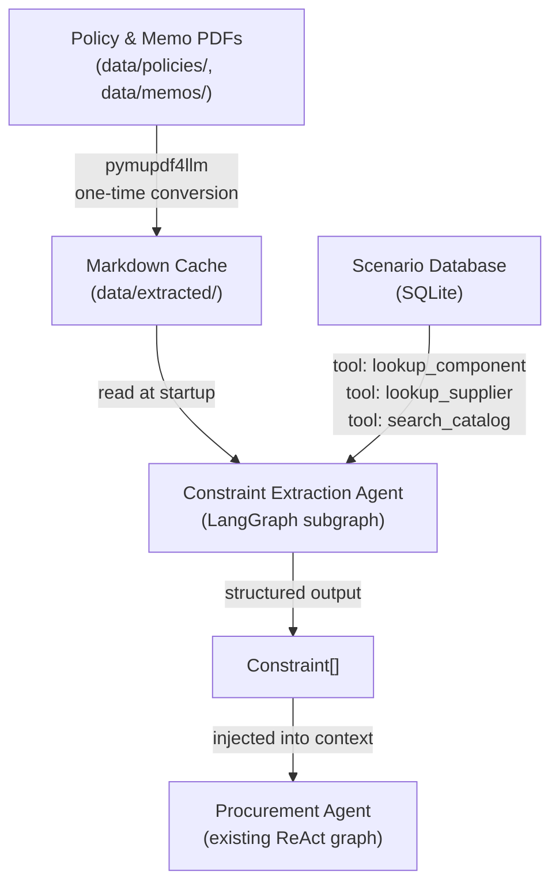

---

## Architecture: Two-Layer Design

### Layer 1 — PDF → Markdown Cache

**Purpose**: Convert PDFs to clean markdown once. Avoid re-conversion unless source files change.

**Library**: `pymupdf4llm`

**Rationale**:
- Our PDFs are simple native-text documents (1-5KB each). No scans, no complex layouts.
- pymupdf4llm is lightweight (no ML models, no GPU), fast, and produces clean markdown from native text.
- Alternatives evaluated:
  - **Marker**: More powerful (handles scans, complex layouts via Surya OCR), but heavy dependency. Overkill for simple text PDFs.
  - **Docling**: Enterprise-grade structured output (IBM Research), slowest option. Way overkill.
  - **pypdf** (current): Works, but produces raw text without structure. pymupdf4llm preserves headings, lists, and section hierarchy.

**Cache location**: `data/extracted/` — sibling to `data/policies/` and `data/memos/`

**Cache structure**:
```
data/
├── policies/
│   └── procurement_policy.pdf
├── memos/
│   ├── memo_2025-04-15_supplier_concentration.pdf
│   ├── memo_2025-07-01_expedited_shipping.pdf
│   └── memo_2025-08-20_pcb_quality.pdf
└── extracted/
    ├── .cache_manifest.json          # maps PDF hash → markdown filename
    ├── procurement_policy.md
    ├── memo_2025-04-15_supplier_concentration.md
    ├── memo_2025-07-01_expedited_shipping.md
    └── memo_2025-08-20_pcb_quality.md
```

**Cache invalidation**: Content-hash based. On startup:
1. Compute SHA-256 of each PDF in `policies/` and `memos/`
2. Compare against `.cache_manifest.json`
3. Re-convert only PDFs whose hash changed or are new
4. Remove markdown files for PDFs that no longer exist

**Manifest format**:
```json
{
  "files": {
    "policies/procurement_policy.pdf": {
      "sha256": "abc123...",
      "extracted_to": "procurement_policy.md",
      "extracted_at": "2026-04-23T14:00:00Z"
    }
  }
}
```

### Layer 2 — Constraint Extraction Agent (LangGraph Subgraph)

**Purpose**: Read cached markdown documents, cross-reference against the scenario database, and produce validated `Constraint[]` output.

**Architecture**: LangGraph `StateGraph` compiled as a standalone subgraph. Can be:
- Invoked as a node within the main pipeline graph
- Run standalone for testing/evaluation

#### Tools

The agent has two categories of tools: **read tools** for grounding against the scenario DB, and **write tools** for building and editing a constraint working set.

##### Read Tools (DB Grounding)

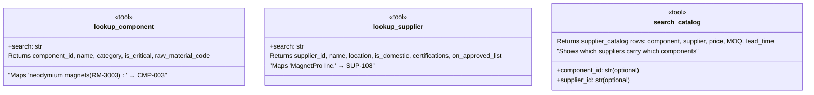

These tools are **read-only** — they query the scenario DB but never modify it. They allow the LLM to resolve natural-language references in policy documents to concrete IDs:

| Document says | Tool call | Resolution |
|--------------|-----------|------------|
| "neodymium magnets (RM-3003)" | `lookup_component("neodymium magnets RM-3003")` | `CMP-003` |
| "MagnetPro Inc. (SUP-108)" | `lookup_supplier("MagnetPro")` | `SUP-108, domestic, approved` |
| "PCB components (RM-3005)" | `lookup_component("PCB RM-3005")` | `CMP-005` |
| "Jiangsu Electronics" | `lookup_supplier("Jiangsu")` | `SUP-113, not on approved list` |

##### Write Tools (Constraint Working Set)

The agent builds constraints through an explicit working set — a mutable list it can inspect, add to, and edit. This is critical for handling **document hierarchy and supersession**: memos that modify or override policy constraints.

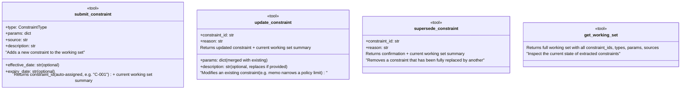

**Why a working set instead of emit-once?**

Policy documents establish baseline constraints. Memos then modify them. The working set lets the agent process documents in order and make edits that are **observable and testable**:

```
1. Agent reads procurement_policy.pdf
   → submit_constraint(CONCENTRATION_LIMIT, {max_pct: 0.70, component_ids: [...]})  → C-001

2. Agent reads memo_2025-04-15_supplier_concentration.pdf
   → "reduced from 70% to 50%... This supersedes Section 4"
   → update_constraint(C-001, {max_pct: 0.50, secondary_min_pct: 0.20},
       reason="MEMO-2025-041 supersedes policy Section 4 for rare earth components")
```

The tool call trace shows exactly how the memo modified the policy constraint — making supersession auditable and debuggable.

**Working set rules:**
- `submit_constraint` appends to the set and returns the assigned ID
- `update_constraint` merges `params` (new keys added, existing keys overwritten) and optionally replaces `description`. The `reason` field is logged for traceability.
- `supersede_constraint` removes the constraint entirely (for cases where a memo fully replaces a policy rule with a different constraint type). The `reason` is logged.
- `get_working_set` returns the full current state — the agent can call this at any time to see what it has so far
- Every write tool returns the current working set summary so the agent always has context on what's been extracted

**Document processing order matters.** The agent processes documents chronologically:
1. Policy documents first (establish baseline)
2. Memos in date order (modify/narrow/supersede baseline)

The system prompt instructs the agent to follow this order and use `update_constraint` / `supersede_constraint` when a memo explicitly references or overrides a prior policy section.

#### State Schema

The state carries the working set as a first-class field:

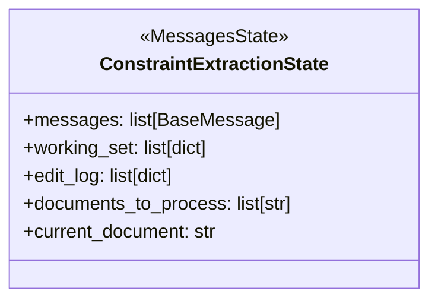

- `working_set` — the live constraint list, modified by `submit/update/supersede`
- `edit_log` — append-only record of every write operation (submit, update, supersede) with timestamps and reasons. This is the audit trail.
- `documents_to_process` — ordered list of markdown documents (policies first, then memos by date)
- `current_document` — which document the agent is currently processing

#### System Prompt

The agent receives:
- All cached markdown documents, labeled with filenames and ordered (policies first, memos by date)
- The `ConstraintType` enum with param schemas
- Instruction to process documents in order, using read tools to resolve IDs and write tools to build the working set
- Explicit instruction: "When a memo references or overrides a policy section, use `update_constraint` or `supersede_constraint` on the existing entry rather than creating a duplicate"

#### Subgraph Structure

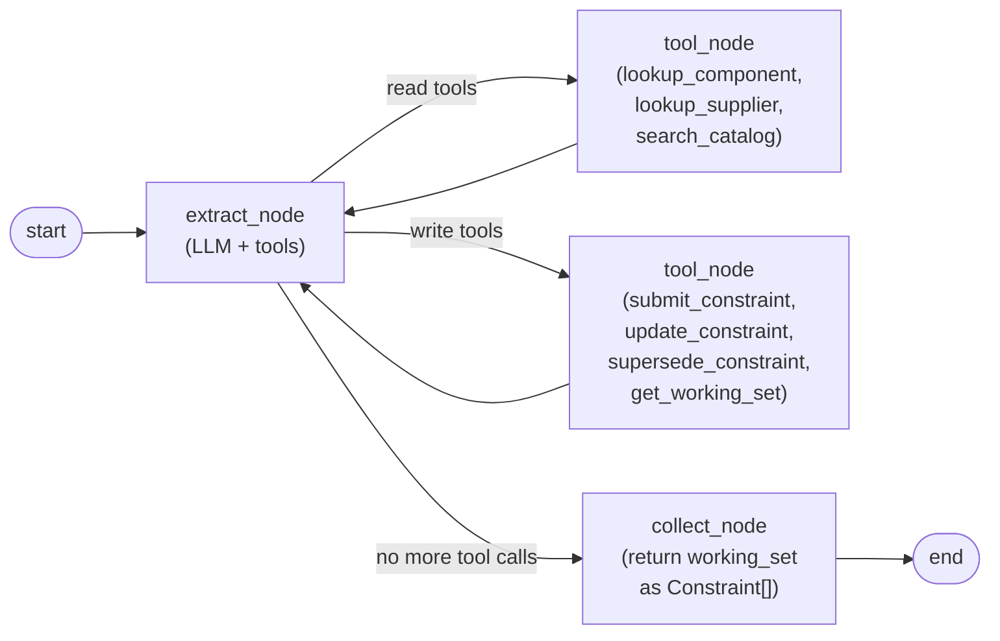

The agent reads documents, resolves references via DB lookups, and builds the constraint set incrementally through the write tools. When it's done processing all documents, the `collect_node` converts the final `working_set` into `Constraint[]` — no parsing of a final text message needed, since the constraints were already structured via tool calls.

#### Example: Full Extraction Trace

This illustrates how the agent processes the procurement policy followed by the supplier concentration memo:

```
── Document 1: procurement_policy.md ──────────────────────────

LLM: I see Section 2 mentions SUP-113 removed from ASL.
     Let me verify this supplier.
  → lookup_supplier("Jiangsu Electronics")
  ← SUP-113, Jiangsu Electronics Co., not on approved list

LLM: Confirmed. Submitting blocked supplier constraint.
  → submit_constraint(
      type=SUPPLIER_BLOCKED,
      params={supplier_id: "SUP-113", reason: "Removed from ASL"},
      source="procurement_policy.pdf")
  ← C-001 added. Working set: [C-001: SUPPLIER_BLOCKED SUP-113]

LLM: Section 4 defines concentration limits. 70% for critical, 85% non-critical.
     I need to identify critical components.
  → lookup_component("critical")
  ← CMP-003 (magnets, critical), CMP-005 (PCB, critical), ...

LLM: Submitting concentration limit for critical components.
  → submit_constraint(
      type=CONCENTRATION_LIMIT,
      params={component_ids: ["CMP-003","CMP-005",...], max_pct: 0.70},
      source="procurement_policy.pdf",
      description="Critical component concentration limit per Section 4")
  ← C-005 added. Working set: [C-001..C-005]

  ... (more constraints from policy) ...

── Document 2: memo_2025-04-15_supplier_concentration.md ──────

LLM: This memo says concentration limit for neodymium magnets
     reduced from 70% to 50%, superseding Section 4. Let me
     find the existing constraint and the component ID.
  → lookup_component("neodymium magnets RM-3003")
  ← CMP-003, Neodymium Magnets N52, raw_material_code=RM-3003
  → get_working_set()
  ← [C-001..C-012]. C-005: CONCENTRATION_LIMIT {component_ids: ["CMP-003",...], max_pct: 0.70}

LLM: C-005 covers CMP-003 at 70%. The memo narrows this to 50%
     for CMP-003 specifically, and adds a 20% secondary minimum.
     I should update the existing constraint for CMP-003.
  → update_constraint(
      constraint_id="C-005",
      params={max_pct: 0.50, secondary_min_pct: 0.20},
      reason="MEMO-2025-041 supersedes Section 4: rare earth concentration reduced to 50%, 20% secondary minimum")
  ← C-005 updated: CONCENTRATION_LIMIT {component_ids: ["CMP-003",...], max_pct: 0.50, secondary_min_pct: 0.20}

  ... (remaining memos) ...
```

This trace shows:
- The agent **resolved** `RM-3003` → `CMP-003` via `lookup_component`
- The agent **inspected** its working set to find the existing concentration constraint
- The agent **updated** (not duplicated) the constraint based on the memo
- The `reason` field captures **why** the edit was made, creating an audit trail

---

## Interface Contracts

### Entry Point: `build_constraint_agent()`

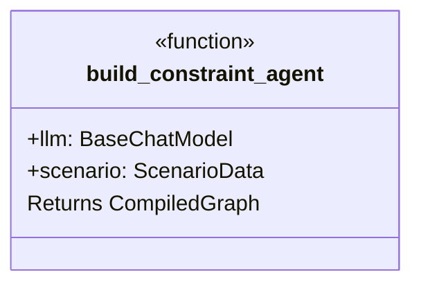

**Location**: `procureai/agents/constraint_graph.py` (new file)

The returned graph accepts `ConstraintExtractionState` and produces a `working_set: list[dict]` (the final constraint set) plus an `edit_log: list[dict]` (the full audit trail of submit/update/supersede operations).

### Entry Point: `ensure_markdown_cache()`

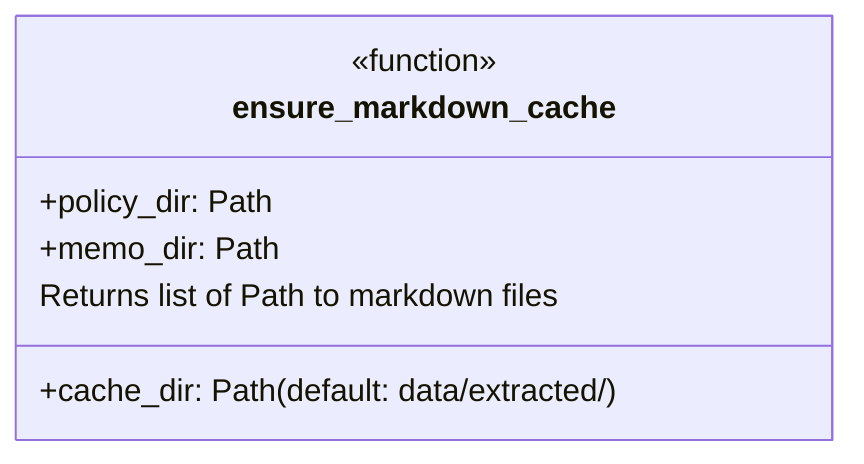

**Location**: `procureai/extraction.py` (new file)

Handles Layer 1: checks cache manifest, converts new/changed PDFs, returns paths to all cached markdown files.

### Updated `extract_constraints()` Signature

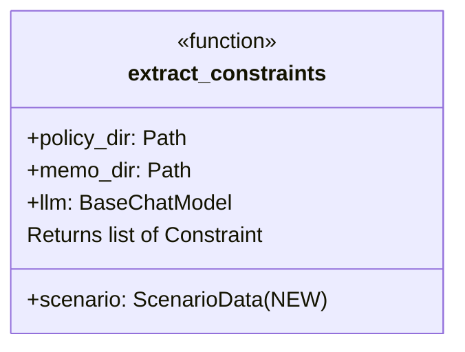

The existing function becomes the orchestrator:
1. Call `ensure_markdown_cache()` — Layer 1
2. Build and invoke the constraint extraction subgraph — Layer 2
3. Convert `working_set` from final state into `Constraint[]`
4. Log the `edit_log` for observability (shows how memos modified policy constraints)
5. Return

### Integration with `agent.py`

The call site changes minimally:

```
# Before (agent.py:120)
constraints = extract_constraints(config.policy_dir, config.memo_dir, llm)

# After
constraints = extract_constraints(config.policy_dir, config.memo_dir, llm, scenario_data)
```

The `scenario_data` parameter gives the constraint agent access to DB tables for grounding.

---

## Key Workflows

### Startup Flow (Cache Hit)

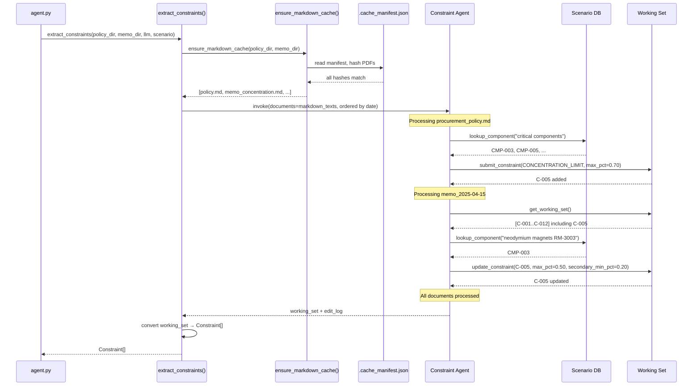

### Startup Flow (Cache Miss — New PDF)

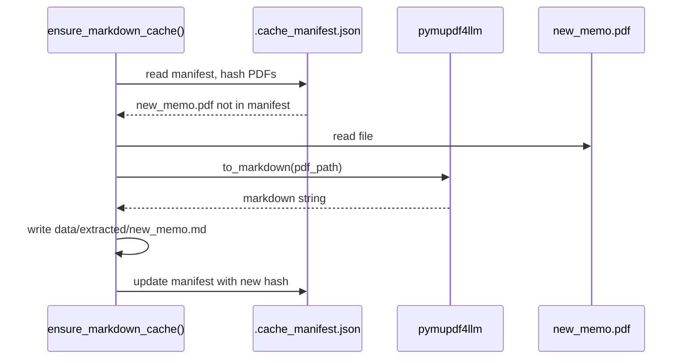

### Standalone Evaluation

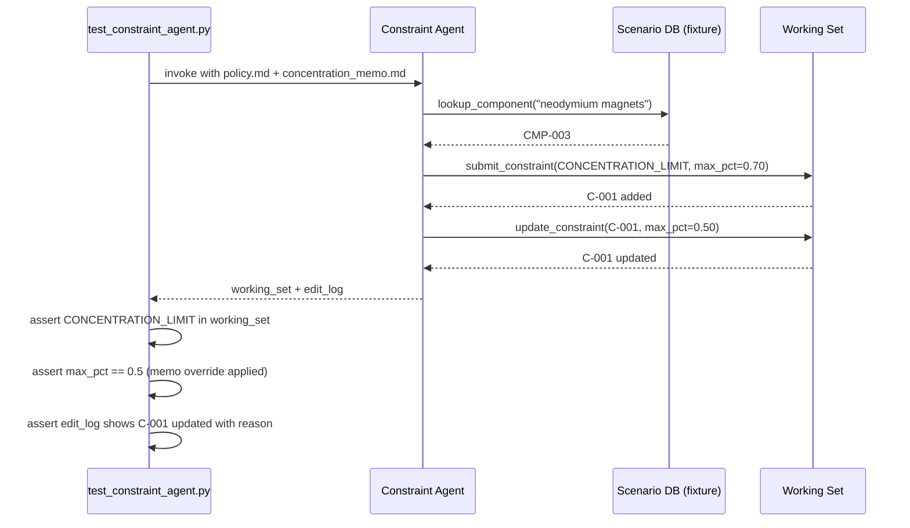

---

## Architecture Options

### Option A: Subgraph Agent (Recommended)

The constraint extraction agent is a LangGraph `StateGraph` with its own tool-calling loop, compiled as a standalone graph.

**Pros**:
- Independently testable — compile and invoke without the procurement agent
- Full tool access — can query the DB to resolve IDs
- Model-evaluatable — run `/model-eval` style tests against just this agent
- Clean isolation — own state, own prompt, own tools
- Composable — slots into the main pipeline as a node

**Cons**:
- More infrastructure than a single LLM call
- Adds a dependency on scenario DB being loaded before constraint extraction
- Slightly more latency at startup (tool-calling loop vs single call)

**When to use**: When extraction quality matters and you want to evaluate/improve it independently. This is our case.

### Option B: Enhanced Single-Call (Not Recommended)

Keep the current single-call approach but feed it markdown (from cache) instead of raw text, and add the component/supplier tables as context in the prompt.

**Pros**:
- Minimal code change
- No new graph infrastructure
- Fastest at runtime (single LLM call)

**Cons**:
- No self-correction — if the LLM misses a constraint, there's no retry
- Can't look up IDs interactively — must dump all component/supplier data into the prompt
- Prompt bloat — all DB tables in context even when most aren't relevant
- Still model-dependent — just with slightly better input

**When to use**: If startup latency is critical and extraction quality is acceptable. Not our case.

### Option C: Hard-Coded Constraints + LLM for New Documents Only

Complete the `DEFAULT_CONSTRAINTS` list to cover all known policy/memo constraints. Only use LLM extraction for documents not already covered by defaults.

**Pros**:
- Completely deterministic for known documents
- Zero LLM cost for known constraints
- Fastest possible startup

**Cons**:
- Requires code changes whenever a policy/memo is updated
- Defeats the purpose of reading documents — might as well not have PDFs
- Doesn't scale to new documents or different deployments
- No learning — adding a new memo requires a developer to manually translate it to code

**When to use**: If the PDF set is truly static and will never change. Not appropriate for a system designed to read policy documents.

### Recommendation

**Option A (Subgraph Agent)**. The whole point of this system is to read policy documents and act on them. The constraint extraction agent gives us grounded, testable, model-evaluatable extraction while preserving the flexibility of LLM interpretation. The startup latency cost (a few extra LLM calls for tool use) is negligible compared to the procurement agent's runtime.

---

## Component Interaction

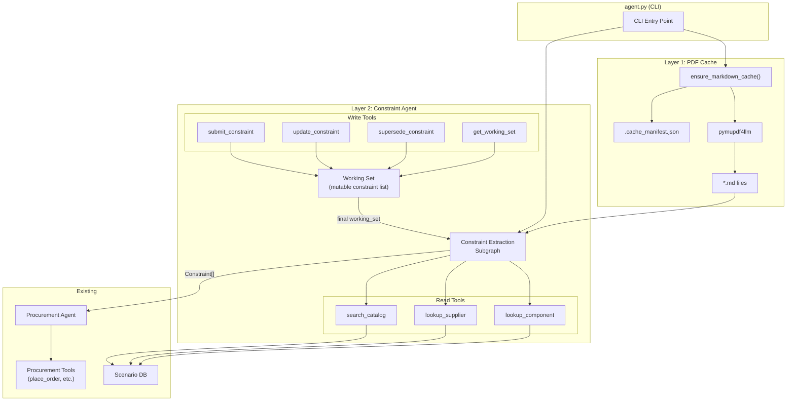

---

## New Files

| File | Purpose |
|------|---------|
| `procureai/extraction.py` | Layer 1: `ensure_markdown_cache()`, PDF hashing, pymupdf4llm conversion |
| `procureai/agents/constraint_graph.py` | Layer 2: `build_constraint_agent()`, subgraph definition, extraction tools |
| `tests/test_extraction.py` | Unit tests for markdown cache (hash checking, conversion, invalidation) |
| `tests/test_constraint_agent.py` | Integration tests for constraint agent (known docs → expected constraints) |

## Modified Files

| File | Changes |
|------|---------|
| `procureai/constraints.py` | Update `extract_constraints()` to orchestrate Layer 1 + Layer 2. Keep `Constraint` model and `ConstraintType` enum unchanged. |
| `agent.py` | Pass `scenario_data` to `extract_constraints()` |
| `pyproject.toml` | Add `pymupdf4llm` dependency |

---

## Testing Strategy

### Unit Tests (`test_extraction.py`)

- Cache miss: PDF exists, no markdown → pymupdf4llm called, markdown written, manifest updated
- Cache hit: PDF unchanged → no conversion, existing markdown returned
- Cache invalidation: PDF content changed (different hash) → re-convert
- New PDF added: only the new file converted
- PDF removed: orphaned markdown cleaned up

### Integration Tests (`test_constraint_agent.py`)

**Baseline extraction (policy only):**
- Feed procurement policy markdown only. Assert:
  - `SUPPLIER_BLOCKED` with `supplier_id: SUP-113`
  - `CONCENTRATION_LIMIT` with `max_pct: 0.70` (the policy default before memo override)
  - `CERT_REQUIRED` for `CMP-005` with `ISO-9001`
  - `HAZMAT_HANDLING` with `component_ids` containing `CMP-010`, `CMP-011`
  - All component/supplier IDs are real (resolved via lookup tools, not raw material codes)

**Supersession (policy + concentration memo):**
- Feed policy markdown then concentration memo. Assert:
  - `CONCENTRATION_LIMIT` has `max_pct: 0.50` (not 0.70 — memo override applied)
  - `secondary_min_pct: 0.20` added by memo
  - `component_ids` contains `CMP-003` (resolved from `RM-3003`)
  - `edit_log` contains an `update` entry for the concentration constraint with a reason referencing MEMO-2025-041
  - No duplicate `CONCENTRATION_LIMIT` constraints (update, not create-new)

**Full document set (policy + all 3 memos):**
- Feed all 4 documents in date order. Assert:
  - `PCB_QUALIFIED_ONLY` with `component_id: CMP-005`
  - `AIR_FREIGHT_ALLOWED` with `start_date: 2025-07-01`, `end_date: 2025-09-30`
  - Concentration constraint reflects memo override
  - Total constraint count is reasonable (no duplicates from memo re-stating policy rules)

**Tool grounding:**
- Verify `lookup_component` is called to resolve `RM-3003` → `CMP-003`
- Verify `lookup_supplier` is called to resolve `Jiangsu Electronics` → `SUP-113`
- Verify the agent does NOT use raw material codes as component IDs in constraint params

**Edit log auditability:**
- Verify `edit_log` has entries for every `submit`, `update`, and `supersede` call
- Verify each `update`/`supersede` entry includes a `reason` field
- Verify the log can reconstruct the constraint evolution (original policy value → memo override)

### Evaluation (`/model-eval` extension)

Add a constraint extraction evaluation phase before the scenario runs:
1. Run constraint agent with the eval model
2. Compare extracted constraints against a known-good reference set
3. Report extraction accuracy as part of the model eval

---

## Migration Path

1. **Add pymupdf4llm dependency** — `uv add pymupdf4llm`
2. **Implement Layer 1** (`extraction.py`) — cache logic, testable independently
3. **Implement Layer 2** (`constraint_graph.py`) — subgraph with tools, testable independently
4. **Update `constraints.py`** — new `extract_constraints()` orchestrates both layers
5. **Update `agent.py`** — pass `scenario_data` to extraction
6. **Run model-eval** — verify constraint extraction quality across models
7. **Remove old extraction code** — delete `EXTRACTION_PROMPT`, `_collect_pdf_texts()`, old `extract_constraints()` body

The `DEFAULT_CONSTRAINTS` list can be kept as a last-resort fallback if both layers fail, but should rarely be needed.

---

## Open Questions

1. **Should we version the cache manifest?** If the pymupdf4llm library version changes, the same PDF might produce different markdown. Adding a library version to the manifest would force re-extraction on upgrade.

2. **Evaluation reference set** — Where should the "known-good" constraint set live for evaluation? Options: a golden JSON file in `tests/fixtures/`, or inline in test assertions.

3. **Working set persistence** — Should the final working set (post-supersession) be cached alongside the markdown, or always re-derived at runtime? Caching avoids the LLM call but means constraint extraction isn't re-evaluated when you switch models. Current design: always re-derive at runtime (the markdown cache saves PDF conversion cost; the LLM interpretation is the part we want to evaluate per-model).

4. **Granularity of `update_constraint` params merge** — When the concentration memo narrows the limit from 70% to 50% for CMP-003 specifically, should the update apply to the whole constraint (replacing all `component_ids`' limit) or create a component-specific override? Current design uses a simple merge (whole constraint updated). A more sophisticated approach would support per-component overrides within a single constraint type.

---

## References

- Current constraint extraction: `procureai/constraints.py`
- Step 1 guardrails (depend on constraints): `procureai/agents/tools.py` lines 428-462
- Model eval results showing extraction failures: `output/model-eval-claude-haiku-4-5-2026-04-23.md`
- Known failure F1 (magnet concentration): `plans/fix-plan.md`
- pymupdf4llm: [GitHub](https://github.com/pymupdf/pymupdf4llm) | [Docs](https://pymupdf.readthedocs.io/en/latest/pymupdf4llm/)
- PDF-to-markdown comparison: [Best Open-Source PDF-to-Markdown Tools in 2026](https://themenonlab.blog/blog/best-open-source-pdf-to-markdown-tools-2026)
- Benchmark analysis: [Benchmarking PDF to Markdown Converters](https://ai.gopubby.com/benchmarking-pdf-to-markdown-document-converters-fc65a2aad180c)
