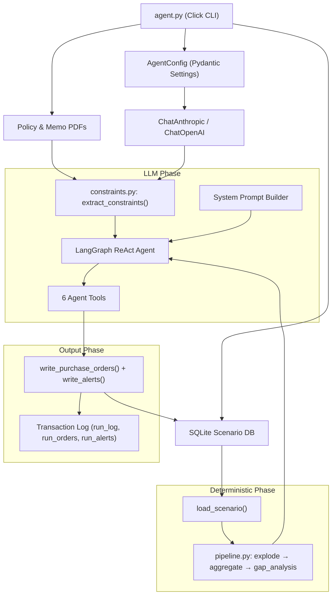
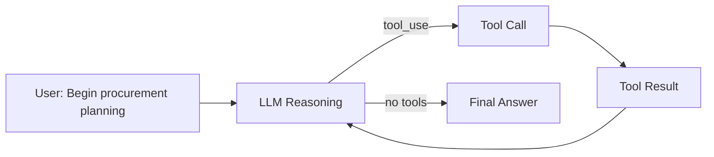
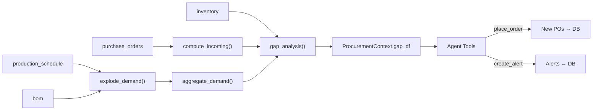
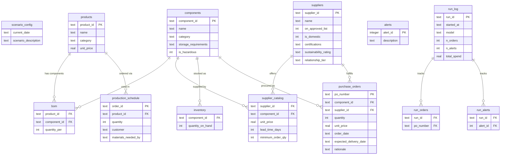

# Current State — ProcureAI

**Generated:** 2026-04-23
**Phase:** Post-implementation, verification & tuning

---

## 1. System Overview

**ProcureAI** is an autonomous AI procurement agent for Apex Manufacturing. Given a scenario SQLite database describing products, BOMs, suppliers, inventory, and production schedules, it computes material requirements, identifies shortfalls, and generates purchase orders while respecting lead times, supplier approval status, and procurement policies.

**Tech stack:** Python 3.12, LangGraph/LangChain, Anthropic Claude, pandas, Pydantic Settings, pypdf, Click, Rich, Plotly

**Repo type:** Single Python package (`procureai`), CLI entry point at `agent.py`.

---

## 2. Architecture Diagrams

### a) High-Level Pipeline



### b) Agent ReAct Loop



### c) Data Flow



### d) Module Dependency Graph

```mermaid
graph TB
    agent["agent.py"]
    config["config.py"]
    pipeline["pipeline.py"]
    constraints["constraints.py"]
    db["utils/db.py"]
    graph["agents/graph.py"]
    tools["agents/tools.py"]
    prompts["agents/prompts.py"]
    state["agents/state.py"]
    callbacks["agents/callbacks.py"]

    agent --> config
    agent --> pipeline
    agent --> constraints
    agent --> db
    agent --> graph

    graph --> prompts
    graph --> tools
    graph --> constraints
    graph --> pipeline
    graph --> db

    tools --> constraints
    tools --> db

    prompts --> constraints
    prompts --> db

    pipeline --> db
    constraints --> |LLM| config
```

---

## 3. Entity Relationship Diagram (Scenario DB)



---

## 4. Key Abstractions and Interfaces

### `ScenarioData` (dataclass) — `procureai/utils/db.py:29`
Holds all tables loaded from a scenario SQLite DB. Fields: `current_date`, `description`, `db_path`, plus DataFrames for each of the 9 domain tables.

### `AgentConfig` (Pydantic Settings) — `procureai/config.py:27`
Loads from env vars (`PROCUREAI_*`) and `.env`. Supports 4 providers: `anthropic`, `openai`, `vllm`, `ollama`. Validates API keys and base URLs per provider.

### `ProcurementContext` (dataclass) — `procureai/agents/tools.py:21`
Mutable shared state for all tools. Holds `scenario`, `constraints`, `gap_df` (updated as orders are placed), `placed_orders`, `placed_alerts`, and PO number sequence.

### `Constraint` (Pydantic model) — `procureai/constraints.py:34`
Represents a single procurement constraint with `type` (enum of 14 types), `params` (dict), `source`, dates, and `description`.

### `ProcurementState` (LangGraph state) — `procureai/agents/state.py:8`
Extends `MessagesState` with summary fields (`shortfalls_summary`, `constraints_summary`, etc.). Currently these extra fields are defined but not actively populated during the agent loop.

### Agent Tools (6 tools) — `procureai/agents/tools.py:78`
| Tool | Purpose |
|------|---------|
| `get_shortfalls` | Return current gap table |
| `get_eligible_suppliers` | Filter suppliers by constraints for a component |
| `place_order` | Validate and record a PO, update gap table |
| `create_alert` | Log a procurement alert |
| `check_concentration` | Show supplier concentration for a component |
| `get_order_status` | Summary of orders placed and remaining gaps |

---

## 5. File Structure

```
.
├── agent.py                          # CLI entry point (Click)
├── main.py                           # Stub (unused)
├── pyproject.toml                    # Package config + dependencies
├── CLAUDE.md                         # AI agent instructions
├── AGENTS.md                         # Agent/skill configuration
├── summary.md                        # Detailed scenario data analysis
├── .env                              # API keys (gitignored)
├── procureai/
│   ├── __init__.py
│   ├── config.py                     # AgentConfig + LLM factory
│   ├── pipeline.py                   # Deterministic BOM explosion + gap analysis
│   ├── constraints.py                # Constraint schema + LLM extraction from PDFs
│   ├── agents/
│   │   ├── __init__.py
│   │   ├── graph.py                  # LangGraph ReAct agent wiring
│   │   ├── tools.py                  # 6 agent tools + ProcurementContext
│   │   ├── prompts.py                # System prompt builder
│   │   ├── state.py                  # ProcurementState (MessagesState ext.)
│   │   └── callbacks.py              # Rich console callback for --verbose
│   ├── discovery/
│   │   ├── __init__.py
│   │   ├── overview.py               # Terminal scenario summary printer
│   │   └── dashboard.py              # Plotly HTML dashboard generator
│   └── utils/
│       ├── __init__.py
│       └── db.py                     # SQLite loader, writer, transaction log
├── tests/
│   ├── __init__.py
│   ├── conftest.py                   # Parameterized fixtures across run scenarios
│   └── test_verification.py          # 12 generic + 4 scenario-specific tests
├── plans/
│   ├── fix-plan.md                   # Known failure analysis + fix plan
│   ├── stage-1-build-agent-loop.md
│   ├── verification-plan.md
│   ├── test-procedure.md
│   └── discovery-scripts.md
├── data/                             # (gitignored)
│   ├── scenarios/                    # 6 SQLite scenario databases
│   ├── policies/                     # procurement_policy.pdf
│   └── memos/                        # 3 supplier memo PDFs
├── output/                           # Generated dashboards
│   └── dashboard_*.html
└── research/                         # Design docs, current-state snapshots
```

---

## 6. Current Implementation Status

### Completed
- Full deterministic pipeline: BOM explosion → demand aggregation → incoming computation → gap analysis
- LLM-based constraint extraction from policy/memo PDFs with fallback defaults
- 14-type constraint schema covering all known policy rules
- LangGraph ReAct agent with 6 tools (shortfalls, supplier lookup, place order, alerts, concentration check, order status)
- Multi-provider support (Anthropic, OpenAI, vLLM, Ollama) via `AgentConfig`
- Transaction log for run tracking and cleanup (`--clean`, `--list-runs`)
- Tool-level validation: approved supplier check, blocked supplier check, cert requirements, MOQ auto-rounding, air freight date-window check, budget threshold alerts
- Verbose mode with Rich console callback handler
- Post-run verification test suite (12 generic + 4 scenario-specific tests)
- Discovery tools (terminal overview, Plotly HTML dashboards)
- All 6 scenarios runnable end-to-end

### Known Issues (from fix-plan.md)
- **F1: Magnet concentration violations** (scenarios 03, 05) — agent doesn't consistently split CMP-003 orders across suppliers to meet ≤50% / ≥20% concentration limits
- **F2: Duplicate orders** (scenario 06) — agent sometimes places identical (component, supplier, quantity) orders

### Not Yet Implemented
- Prompt reinforcement for magnet dual-sourcing split
- Tool-level guardrail in `place_order` for concentration limit enforcement
- Tool-level duplicate order detection/warning
- Multi-model evaluation across haiku/sonnet/opus
- `ProcurementState` extra fields are defined but unused during agent execution

---

## 7. Testing

### Test Suite: `tests/test_verification.py`
Post-run verification tests — parameterized across all scenarios that have agent-placed POs.

**Generic tests (12):**
| Test | What it validates |
|------|-------------------|
| `test_no_blocked_suppliers` | SUP-113 never receives orders |
| `test_pcb_supplier_compliance` | CMP-005 orders from ISO-9001 suppliers only |
| `test_magnet_concentration_max` | No supplier >50% of CMP-003 volume |
| `test_magnet_concentration_min_secondary` | Secondary CMP-003 supplier ≥20% |
| `test_moq_compliance` | All quantities ≥ supplier MOQ |
| `test_price_accuracy` | Unit prices match supplier catalog |
| `test_delivery_date_math` | Delivery = current_date + lead_time (±air freight) |
| `test_rationale_present` | Every PO has non-empty rationale |
| `test_no_hallucinated_suppliers` | All supplier IDs exist in DB |
| `test_no_hallucinated_components` | All component IDs exist in DB |
| `test_all_shortfalls_addressed` | Every gap has a PO or alert |
| `test_only_approved_suppliers` | All orders to approved suppliers |
| `test_no_exact_duplicate_orders` | No identical (component, supplier, qty) duplicates |

**Scenario-specific tests (4 classes):**
- `TestScenario06` — happy path (≥2 POs, no critical alerts)
- `TestScenario02` — partial procurement (existing POs reduce gaps, no double-ordering)
- `TestScenario03` — tight timeline (deadline alerts present, no impossible delivery dates)
- `TestScenario05` — competing demand (correct date, no air freight after Sept 30)

**Last known results:** 72 pass, 5 fail, 10 skip (failures are F1 + F2 from fix-plan)

---

## 8. Dependencies

### Runtime
| Package | Purpose |
|---------|---------|
| `anthropic` ≥0.52.0 | Anthropic API client |
| `langchain-anthropic` ≥0.3.12 | LangChain ChatAnthropic wrapper |
| `langchain-core` ≥0.3.49 | Base LangChain abstractions |
| `langchain-openai` ≥0.3.0 | OpenAI-compatible model support |
| `langgraph` ≥0.4.1 | ReAct agent framework |
| `pandas` ≥3.0.2 | Data manipulation (BOM explosion, gap analysis) |
| `pydantic-settings` ≥2.9.1 | Configuration management |
| `pypdf` ≥5.4.0 | PDF text extraction |
| `click` ≥8.3.3 | CLI framework |
| `rich` ≥13.0.0 | Console formatting (verbose mode) |
| `plotly` ≥6.7.0 | Dashboard generation |

### Dev
| Package | Purpose |
|---------|---------|
| `pytest` ≥8.0.0 | Test runner |
| `pytest-cov` ≥6.0.0 | Coverage reporting |
| `ruff` ≥0.11.0 | Linting + formatting |
| `hatchling` ≥1.29.0 | Build backend |

---

## 9. Design Decisions & Architecture Notes

1. **Deterministic pipeline + LLM agent hybrid** — BOM math and gap analysis are pure pandas (no hallucination risk). Only supplier selection and order splitting involve LLM reasoning.

2. **Closure-based tools** — All 6 tools close over a shared `ProcurementContext`, enabling mutable state (gap table updates, order tracking) without LangGraph state management complexity.

3. **Transaction log pattern** — Every agent run gets a UUID, and all inserted rows are tracked in `run_orders`/`run_alerts` tables. This enables precise cleanup without touching pre-existing scenario data.

4. **Constraint extraction with fallback** — LLM reads PDFs to extract structured constraints. If extraction fails, hard-coded `DEFAULT_CONSTRAINTS` ensure the agent still respects critical rules (SUP-113 blocked, ISO-9001 for PCBs, etc.).

5. **Multi-provider config** — Pydantic Settings with `PROCUREAI_*` env vars. Supports Anthropic, OpenAI, vLLM, and Ollama via a single `get_chat_model()` factory.
