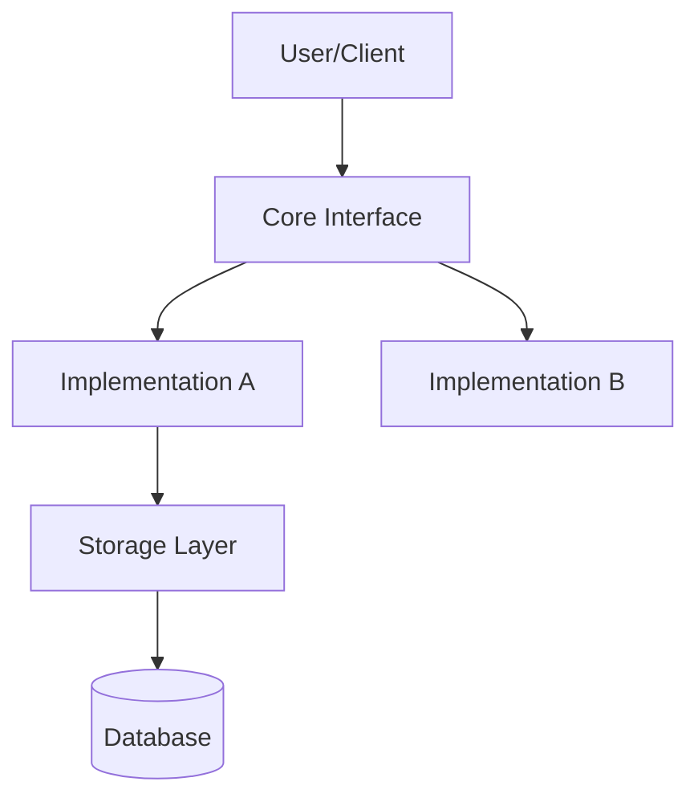
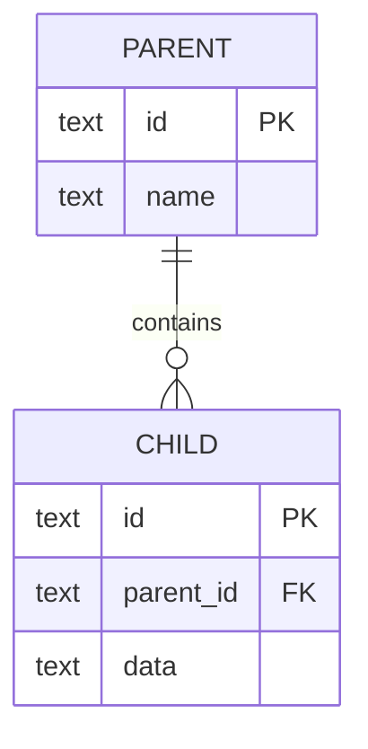

# Current State Skill

Generate a comprehensive current state document for the current repo with architecture diagrams, ERDs, and state management documentation.

## Your Task

You are generating a snapshot of the current system architecture to help developers understand the codebase structure.

## Step 1: Read Configuration

First, read `./AGENTS.md` (relative to the current working directory) to get the `diagram_output_dir` configuration.

## Step 2: Validate Output Path

Check if the diagram output directory exists. If not, create it using the Bash tool.

## Step 3: Gather System Information

Discover the repo structure using Glob and Read tools. Key things to look at:

**Backend / Server Code** (if present):
- Core data models and type definitions
- Public interfaces / abstract classes
- Storage or persistence layer abstractions
- Database models / schemas
- Main service / provider implementations

**Frontend / Client Code** (if present):
- Entry point / main app component
- Component tree (glob for source files)
- State management approach (Context, Redux, Zustand, hooks, signals, etc.)

**Configuration**:
- Dependency manifests (`pyproject.toml`, `package.json`, `Cargo.toml`, `go.mod`, etc.)
- Build / task runner files (`justfile`, `Makefile`, `package.json` scripts)
- Runtime config

Do not assume the repo matches any specific template - discover its structure from the filesystem.

## Step 4: Generate Architecture Documentation

Create a comprehensive markdown document with the following sections:

### 1. System Overview
- Project name and purpose
- Current phase / status (if discoverable from README or plans)
- Technology stack summary
- Repo structure (monorepo? single package? etc.)

### 2. Architecture Diagrams

Use Mermaid diagrams to illustrate the system. Adapt to what actually exists in the repo:

**a) High-Level Architecture**



**b) Key Abstractions**
Show each significant abstract class / interface and its implementations.

**c) Storage / Data Layer**
Show relationships between storage abstractions.

**d) Data Flow**
Show the flow from input → processing → output / persistence.

### 3. Entity Relationship Diagram (ERD)

If the repo has a database or persistent data model, generate a Mermaid ERD showing tables, relationships, foreign keys, and key indexes.

Example:


### 4. Frontend Architecture (if implemented)

- Component hierarchy
- State management approach
- Data flow between components
- State management diagram

If the frontend is minimal or not present, state this clearly.

### 5. Key Abstractions and Interfaces

Document the core abstractions with their public methods and implementations. Name them literally as they appear in the repo.

### 6. File Structure

Show the directory tree with key files annotated. Do not copy a template - reflect the actual layout.

### 7. Current Implementation Status

- **Completed**: features you can verify in the code
- **In Progress**: partial implementations, TODOs, scaffolded-but-empty files
- **Planned**: features referenced in plans/READMEs but not yet implemented

### 8. Dependencies

List key dependencies extracted from the dependency manifest files.

### 9. Testing Coverage

- Report current test coverage if available (e.g. from CI config or coverage files)
- List test files and what they cover
- Identify gaps in test coverage

## Step 5: Generate Output File

Create the output file with naming convention: `current-state-YYYY-MM-DD.md`

Write to: `{diagram_output_dir}/current-state-{today's date}.md`

## Step 6: User Confirmation

After generating the document, show the user the output file path, a brief summary of what was documented, and any notable gaps or areas that need attention.

Ask: "I've created the current state document at `{path}`. Would you like me to update anything or add more detail to any section?"

## Step 7: Emit Subagent Report

End your response with a structured report block so the orchestrator can parse status:

```
### Subagent Report
- phase: current-state
- status: success | blocked | partial
- open_questions:
  - <question 1>
  - <question 2>
```

Use `partial` if sections are missing because parts of the repo are not yet implemented (note which), `blocked` if you couldn't proceed without user input, `success` otherwise.

## Important Notes

- Use only information from actual code files - don't make assumptions
- If a component doesn't exist yet, mark it as "Planned" or "Not Implemented"
- Keep diagrams clear and readable
- Focus on architecture over implementation details
- Use absolute paths from the repo root when referencing files
