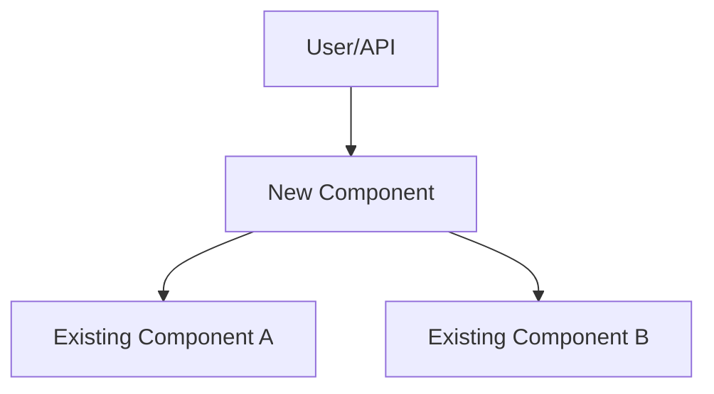
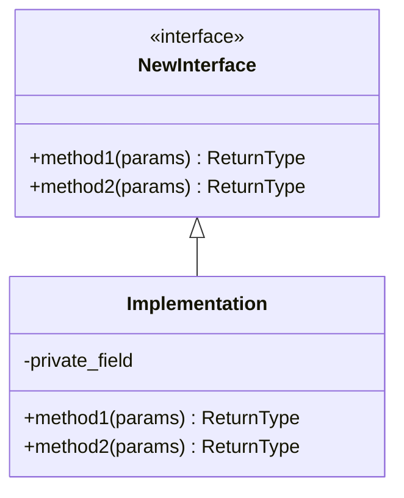
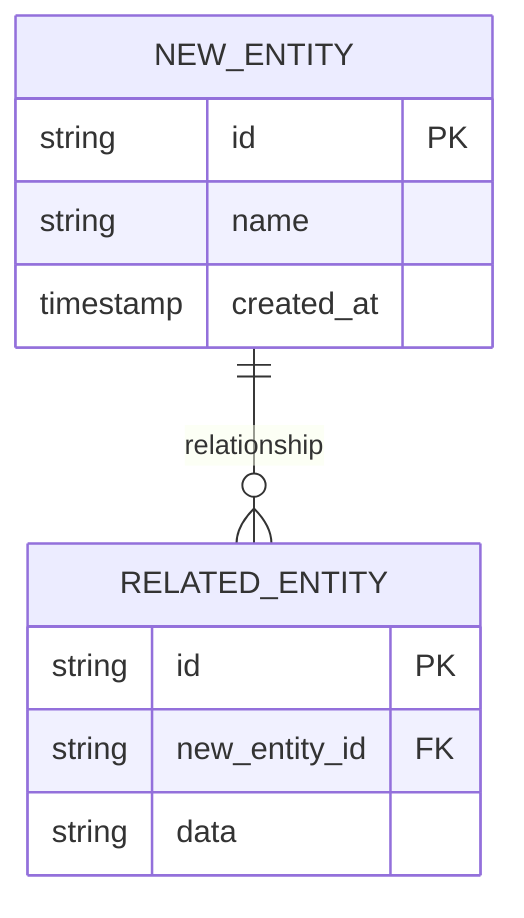
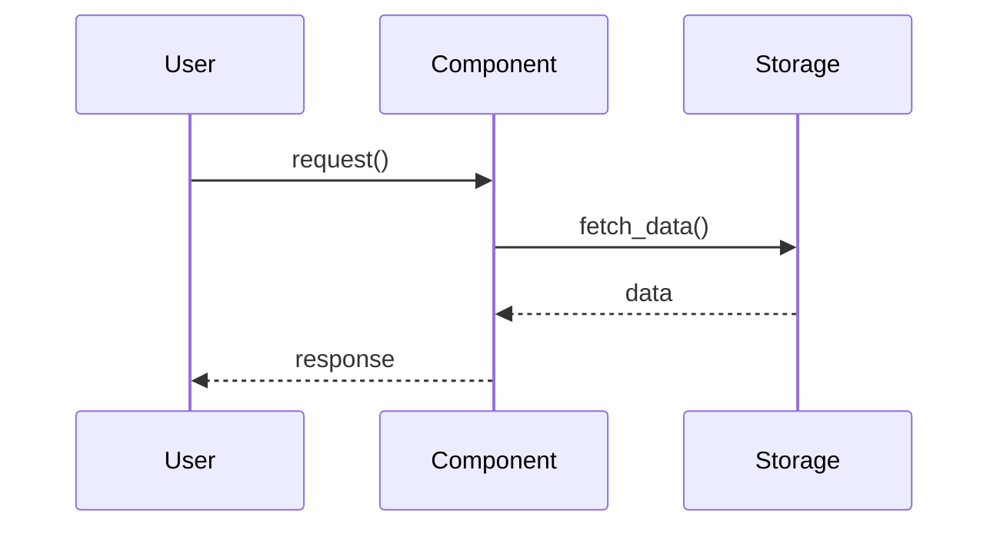
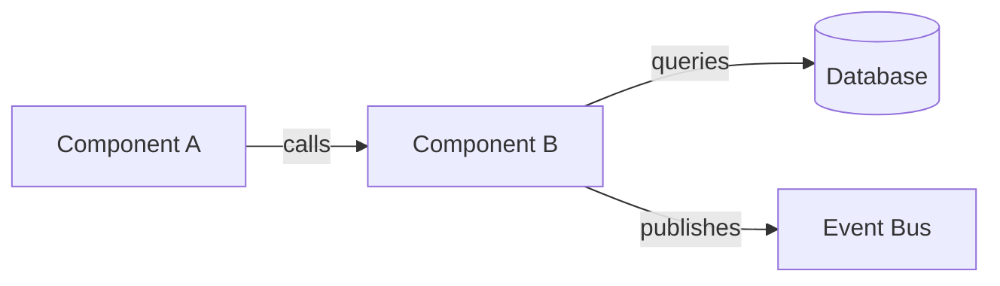

# Design Skill

Interactively explore and document the design for a new feature or system component, with explicit user validation at each step.

## Your Task

Guide the user through a collaborative design process that produces Interface Contract Diagrams (ICDs), Entity Relationship Diagrams (ERDs), and architectural trade-off analysis. This is a research and design activity - DO NOT write pseudocode or implementation details.

## Step 1: Read Configuration

Read `./AGENTS.md` (relative to the current working directory) to get the `design_output_dir` configuration for this repo.

## Step 2: Validate Output Path

Check if the design output directory exists (commonly `research/` but check AGENTS.md). If not, create it.

## Step 3: Gather Requirements (Interactive)

**Prompt the user**:

"I'll help you design a new feature or component. Please provide:

1. **Problem Statement or Use Case**: What are you trying to build or improve?
2. **Scope**: Is this a new feature, enhancement, or refactoring?
3. **Context**: Any specific constraints, requirements, or integration points?"

**Wait for user response before proceeding.**

> When dispatched by the orchestrator, the user response may already be supplied as "Issue context" in the initial prompt (e.g. the Linear issue body). Treat that as the user's initial message and skip waiting.

## Step 4: Ask Clarifying Questions

Based on the user's response, ask targeted clarifying questions such as:

- What are the key user interactions or workflows?
- What data needs to be stored or retrieved?
- Are there performance or scalability requirements?
- Should this integrate with existing components? Which ones?
- Are there external API or service dependencies?
- What are the non-functional requirements (security, observability, etc.)?

**Present 3-5 specific questions based on their use case.**

**Wait for user answers before proceeding.**

## Step 5: Document Analysis Preview

Before analyzing the codebase, tell the user:

"I'm going to analyze the following to understand the current architecture:

**Existing Code**:
- [List specific files you'll read, e.g., `<repo>/<module>/base.py`]
- [List directories you'll search, e.g., `<repo>/<module>/storage/`]

**Planning Documents**:
- [List relevant plan files, e.g., files under `plans/`]

**External Research**:
- [List web searches you'll perform]

Does this look right? Should I focus on any other areas?"

**Wait for user confirmation before proceeding.**

## Step 6: Research and Analysis

Perform the analysis you outlined:

1. **Read relevant code files** using the Read and Glob tools
2. **Review planning documents** from `plans/` or similar directory
3. **Search the web** for best practices, design patterns, and similar implementations
4. **Analyze current architecture** for integration points

Take detailed notes on:
- Existing patterns that should be followed
- Potential integration points
- Similar problems solved elsewhere in the codebase
- Industry best practices

## Step 7: Present Preliminary Findings

Share what you learned with the user:

"Based on my analysis, here's what I found:

**Current Architecture Patterns**:
- [Key patterns]
- [Architectural principles]

**Integration Points**:
- [Where this feature fits]

**Best Practices from Research**:
- [External patterns found]

**Follow-up Questions**:
- [Ask 2-3 questions based on findings]

Please review and let me know if I'm on the right track."

**Wait for user validation before proceeding.**

## Step 8: Generate Design Artifacts

Create the following design artifacts using Mermaid diagrams and markdown:

### A. System Context Diagram

Show how the new component fits into the overall system:



### B. Interface Contract Diagrams (ICDs)

Document the interfaces/APIs for the new component:



Include:
- Method signatures (name, parameters, return types)
- Key attributes/properties
- Relationships to existing interfaces

### C. Entity Relationship Diagrams (ERDs)

If the feature involves data modeling:



### D. Sequence Diagrams

Show key workflows and interactions:



### E. Component Interaction Diagram

Show how components communicate:



## Step 9: Architecture Trade-offs Analysis

Create a structured analysis of design options:

### Option 1: [Approach Name]

**Pros**:
- [Advantage 1]
- [Advantage 2]

**Cons**:
- [Disadvantage 1]
- [Disadvantage 2]

**When to use**: [Scenario where this is best]

### Option 2: [Alternative Approach]

**Pros**:
- [Advantage 1]

**Cons**:
- [Disadvantage 1]

**When to use**: [Scenario where this is best]

### Recommendation

[State your recommended approach with justification based on the project's constraints, existing patterns, and requirements]

## Step 10: Draft Design Document

Compile everything into a structured design document:

```markdown
# [Feature Name] Design Document

**Date**: YYYY-MM-DD
**Author**: Claude Code
**Status**: Draft

## Problem Statement

[The use case and problem being solved]

## Goals and Non-Goals

**Goals**:
- [What this design achieves]

**Non-Goals**:
- [What this design explicitly doesn't address]

## System Context

[Context diagram]

## Interface Contracts

[ICDs with method signatures and descriptions]

## Data Model

[ERDs if applicable]

## Key Workflows

[Sequence diagrams showing main flows]

## Architecture Options

[Trade-offs analysis from Step 9]

## Integration Points

[How this integrates with existing code]

## Testing Strategy

[How this will be tested - unit, integration, e2e]

## Migration Path

[If this changes existing functionality, how to migrate]

## Open Questions

[Any unresolved design questions]

## References

- [Links to relevant docs, RFCs, or external resources]
```

## Step 11: Show Draft to User

Present the draft design document to the user:

"I've drafted a design document based on our discussion. Here are the key design decisions:

**Main Components**:
- [List main components/interfaces]

**Data Model Changes**:
- [List any new tables/models]

**Integration Approach**:
- [How it integrates with existing code]

**Recommended Approach**: [Your recommendation]

Please review the design. Should I:
1. Add more detail to any section?
2. Consider additional alternatives?
3. Revise any design decisions?
4. Proceed to write the final document?"

**Wait for user feedback.**

## Step 12: Generate Output File

Based on user feedback, create the final design document.

**File naming**: `{feature-name}-design-YYYY-MM-DD.md`

**Output path**: `{design_output_dir}/{feature-name}-design-{today's date}.md`

Example: `research/caching-layer-design-2026-04-09.md`

## Step 13: Final Confirmation

After writing the file, tell the user:

"Design document created at: `{full path}`

This design is ready to be converted into an implementation plan using the `plan` skill.

Would you like me to:
1. Make any revisions to this design?
2. Create an implementation plan now using `plan`?
3. Research any specific aspects further?"

## Step 14: Emit Subagent Report

End your response with a structured report block so the orchestrator can parse status:

```
### Subagent Report
- phase: design
- status: success | blocked | partial
- open_questions:
  - <question 1>
  - <question 2>
```

Include any unresolved questions from the design's "Open Questions" section. Use `blocked` if you could not proceed without user input, `partial` if the artifact was written but key sections are unresolved, `success` otherwise.

## Important Constraints

- **NO pseudocode** - This is conceptual design only
- **NO implementation code** - Save that for the `implement` skill
- **Use diagrams** - Visual representations are critical
- **Focus on contracts** - Interface definitions, not implementations
- **Document trade-offs** - Every decision should show alternatives considered
- **Validate frequently** - Get user buy-in at each major step

## Tips for Good Design Documents

1. **Start with the problem** - Always ground the design in the use case
2. **Show alternatives** - Never present just one option
3. **Use existing patterns** - Follow established architecture in the codebase
4. **Think about testing** - Design for testability from the start
5. **Consider migration** - If changing existing code, plan the transition
6. **Be specific** - Use concrete type names, not "data structure"
7. **Ask questions** - Better to clarify now than redesign later

## Error Handling

If at any step the user provides unclear or conflicting information:
- Ask specific clarifying questions
- Present concrete examples
- Offer multiple interpretations and ask them to choose

If you can't find relevant information in the codebase or web:
- Tell the user what you couldn't find
- Ask if they have additional context
- Proceed with reasonable assumptions, clearly stated
