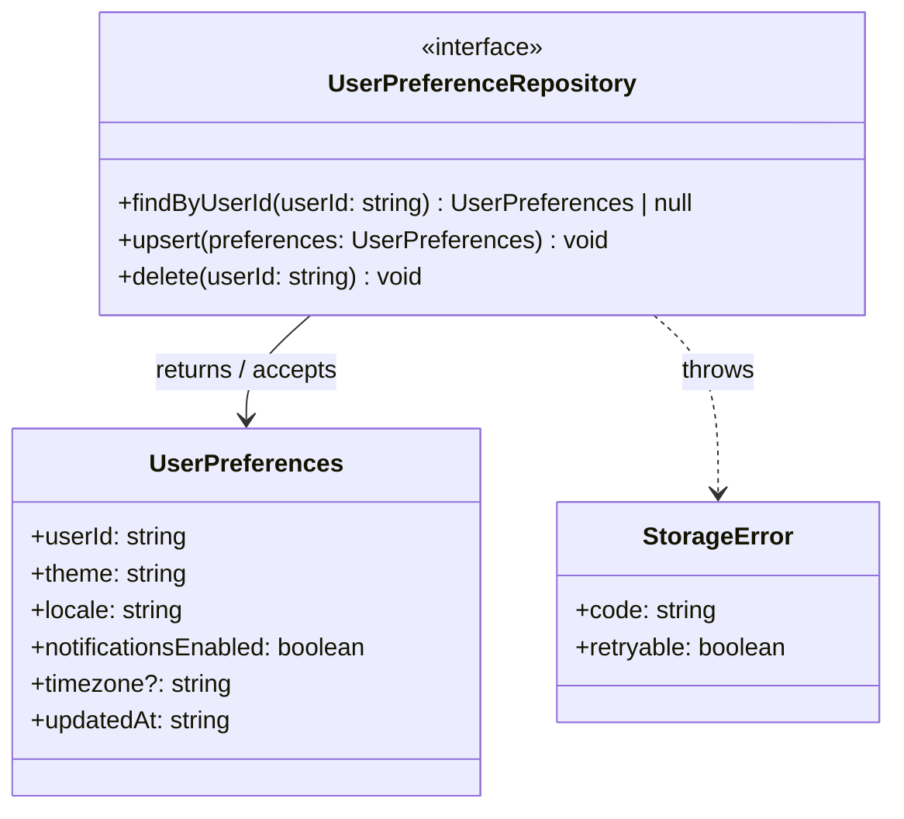

# ICD Skill

Produce a formal Interface Contract Document with complete type signatures, error contracts, and diagrams. This is a **specification artifact** — it defines what code must do, not how it does it.

## Your Task

Extract or derive all interface boundaries from a design document or description, then specify them completely: every method signature, every DTO field, every error type, every status code. The output is used by both `plan` (to drive test writing) and `implement` (to guide correct implementation).

## Step 1: Read Configuration

Read `./AGENTS.md` to get:
- `design_output_dir` — where to write the ICD
- Language and framework — determines type annotation style (TypeScript interfaces vs. Python Protocols vs. Go interfaces, etc.)

## Step 2: Gather Input

**Prompt the user**:

"I'll produce a formal Interface Contract Document.

Please provide one of:
1. **Design document path** (I'll extract the interface sections)
2. **Free-form description** (describe the interfaces you need: what module/service, what operations, what data flows across the boundary)

Also tell me:
- Are there existing types/interfaces in the codebase I should reuse or extend?
- Is there an existing OpenAPI spec, GraphQL schema, or protobuf file I should reference?
- Which module boundaries should this ICD cover? (e.g., 'just the storage layer' vs. 'all public APIs')"

**Wait for user response.**

> When dispatched with a design doc path or issue context already in the prompt, extract interface information from it and skip waiting.

## Step 3: Read Existing Patterns

Before specifying anything, read the codebase for existing interface conventions:

1. Glob for existing interface files, type files, or schema files
2. Read 2–3 representative examples to understand:
   - How interfaces/protocols are declared in this language/framework
   - Naming conventions (e.g., `I`-prefix, `Protocol` suffix, `interface` keyword)
   - How optional fields are marked
   - How errors are typed (exceptions, result types, discriminated unions)
   - How external API DTOs are structured (camelCase vs. snake_case, etc.)
3. Read any existing OpenAPI/GraphQL/protobuf files if present

If a design document was provided, read it now and extract:
- All "Interface Contract" or "ICD" sections
- All method signatures mentioned
- All data models and entities
- All error cases mentioned

## Step 4: Ask Clarifying Questions

Based on what you found, ask targeted questions about anything unclear:

- For each interface boundary: "What are all the operations this boundary needs to support?"
- For each DTO: "Which fields are required vs. optional? Are there validation rules?"
- For error cases: "What error types should callers handle? What information does each error carry?"
- For backward compatibility: "Are any of these interfaces replacing existing ones? What's the migration path?"
- For testability: "Can each interface be tested in isolation, or does it require a real dependency?"

**Present 3–6 specific questions.** Do not ask generic questions — be specific to this design.

**Wait for user answers.**

## Step 5: Generate the ICD

Produce the full Interface Contract Document. Organize by module boundary.

### Structure

For each boundary (e.g., "Storage Layer", "API Layer", "Event Bus"):

#### Interfaces / Protocols

For each interface:
- Full declaration in the repo's language (TypeScript `interface`, Python `Protocol`, Go `interface`, etc.)
- Every method with: parameter names, parameter types, return type, error type
- Doc comment explaining the contract (what it does, not how)

Example (TypeScript):
```typescript
/**
 * Persists and retrieves user preference records.
 * Implementations must be idempotent for upsert operations.
 */
interface UserPreferenceRepository {
  /** Returns null if no preferences exist for this userId. */
  findByUserId(userId: string): Promise<UserPreferences | null>;

  /** Creates or replaces the preference record. Throws StorageError on failure. */
  upsert(preferences: UserPreferences): Promise<void>;

  /** Permanently deletes all preferences for this user. Idempotent. */
  delete(userId: string): Promise<void>;
}
```

Example (Python):
```python
class UserPreferenceRepository(Protocol):
    """Persists and retrieves user preference records.

    Implementations must be idempotent for upsert operations.
    """

    def find_by_user_id(self, user_id: str) -> Optional[UserPreferences]:
        """Returns None if no preferences exist for this user_id."""
        ...

    def upsert(self, preferences: UserPreferences) -> None:
        """Creates or replaces the preference record. Raises StorageError on failure."""
        ...

    def delete(self, user_id: str) -> None:
        """Permanently deletes all preferences for this user. Idempotent."""
        ...
```

#### Request / Response DTOs

For each data object:
- Full type declaration
- Every field: name, type, required/optional, validation rules, description
- Example value (JSON or equivalent)

Example:
```typescript
interface UserPreferences {
  userId: string;          // required — UUID v4
  theme: 'light' | 'dark' | 'system';  // required
  locale: string;          // required — BCP 47 language tag (e.g., 'en-US')
  notificationsEnabled: boolean;  // required
  timezone?: string;       // optional — IANA timezone (e.g., 'America/New_York'); defaults to 'UTC'
  updatedAt: string;       // required — ISO 8601 datetime, set by repository on write
}
```

#### Error Contracts

For each error type:
- Error class/type declaration
- Fields: message, code, context
- When it is thrown/returned
- What the caller should do with it

Example:
```typescript
class StorageError extends Error {
  readonly code: 'NOT_FOUND' | 'CONFLICT' | 'UNAVAILABLE';
  readonly retryable: boolean;

  // NOT_FOUND: record does not exist — caller should handle gracefully
  // CONFLICT: concurrent write detected — caller may retry
  // UNAVAILABLE: backend is down — caller should surface error to user
}
```

#### Mermaid Class Diagram

Show interface hierarchies and DTO relationships:



#### Backward Compatibility Notes

For any interface that replaces or extends an existing one:
- What changed (added, removed, renamed)
- Whether existing callers need to be updated
- Migration path if callers need to change

#### Testability Checklist

For each interface, confirm:
- [ ] Can be instantiated with a test double (mock/stub/fake)?
- [ ] No hidden dependencies (filesystem, network, time) that can't be injected?
- [ ] All error paths are reachable in tests?
- [ ] Async/sync behavior is deterministic in tests?

## Step 6: Show Draft to User

Present the draft ICD and ask:

"Here's the Interface Contract Document covering {n} boundaries and {m} interfaces.

**Boundaries covered**:
- {list}

**Types defined**:
- {n} interfaces/protocols
- {m} DTOs
- {k} error types

Please review:
1. Are all boundaries covered?
2. Are any fields missing, wrongly typed, or wrongly marked optional/required?
3. Are the error contracts complete?
4. Does the testability checklist surface any issues?
5. Proceed to write the ICD file?"

**Wait for user feedback.**

## Step 7: Generate Output File

**File naming**: `{feature-name}-icd-{today's date}.md`

**Output path**: `{design_output_dir}/{feature-name}-icd-YYYY-MM-DD.md`

Structure the file as:

```markdown
# Interface Contract Document: [Feature Name]

**Date**: YYYY-MM-DD
**Author**: Claude Code
**Design document**: `{path, or "derived from free-form description"}`
**Status**: Draft | Final

## Purpose

{What boundary or feature this ICD specifies. Who are the producers and consumers of these interfaces.}

## Covered Boundaries

{List each boundary covered and a one-line description.}

---

## Boundary: [Name]

### Interfaces

{Full interface declarations}

### DTOs

{Full DTO declarations}

### Error Contracts

{Full error type declarations}

### Class Diagram

{Mermaid diagram}

### Backward Compatibility

{Notes, or "Not applicable — new interface."}

### Testability Checklist

{Checklist per interface}

---

{Repeat for each boundary}

## Open Questions

{Any unresolved decisions — field types still TBD, error codes not finalized, etc.}

## References

- Design document: `{path}`
- Related ICDs: `{paths}`
- Existing interfaces extended: `{paths}`
```

## Step 8: Final Confirmation

After writing the file:

"ICD written to: `{full path}`

This document is ready to be used as input to:
- `design-review` (for ICD completeness checking)
- `plan` (for test case derivation)
- `implement` (for exact signature compliance)

Would you like to:
1. Make any revisions?
2. Run `design-review` against the design + this ICD?
3. Proceed to `plan`?"

## Step 9: Emit Subagent Report

End your response with:

```
### Subagent Report
- phase: icd
- status: success | blocked | partial
- open_questions:
  - <question 1>
  - <question 2>
```

Use `blocked` if the design doc couldn't be read or the input was too ambiguous to produce a useful ICD. Use `partial` if some boundaries were covered but others were deferred. Use `success` otherwise.

## Important Constraints

- **No pseudocode** — declarations only, no method bodies
- **No implementation details** — specify what, not how
- **Full types** — no `any`, no `object`, no `unknown` unless explicitly justified
- **Match the repo's type system** — follow existing annotation conventions exactly
- **Version compatibility** — always note if an interface is new vs. extending existing
- **Keep the ICD current** — if revisions are requested, update the file rather than creating a new one (unless the date has changed)
